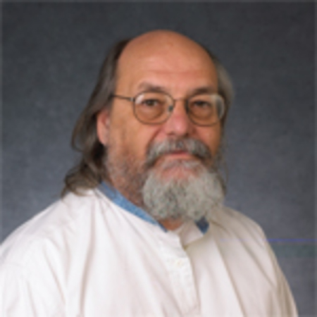
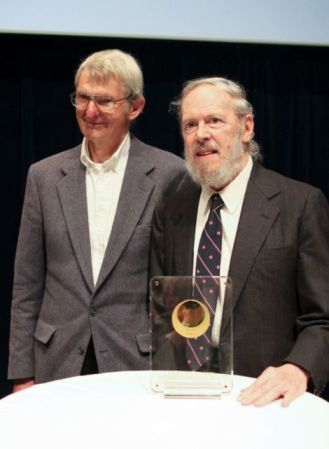
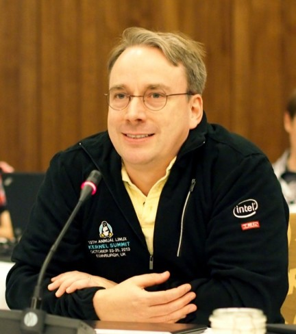

.. _00_intro:

Welcome to CS312
================

Welcome
~~~~~~~

:Instructors: Lance Albertson, Jordan Evans
:Location: KEC 1001
:Course Email: cs312@osuosl.org
:Course website: http://cs312.osuosl.org
:Office Hours: by appointment
:TA: TBA
:Class list: cs312-w16@ENGR.ORST.EDU

Textbook
~~~~~~~~

*System Administration Handbook (4th Edition)* by Evi Nemeth et al

* You are responsible for any material presented in-class, even if not covered
  by the textbook.
* You are responsible for all assigned reading from the book, even if it is not
  discussed in-class

Measurable Student Learning Outcomes
~~~~~~~~~~~~~~~~~~~~~~~~~~~~~~~~~~~~

#. **Design** a configuration for multiple machines to achieve a specific task.
#. **Demonstrate** how to install an operating system, partition disk space, add
   and remove network services, connect to a network, and validate system
   performance.
#. **Demonstrate** how to manipulate user accounts across multiple machines
   working in concert, including adding/deleting users, checking disk space
   usage, changing passwords, tracking resource utilization, and tracking login
   frequency.

Measurable Student Learning Outcomes
~~~~~~~~~~~~~~~~~~~~~~~~~~~~~~~~~~~~

4. **Demonstrate** how to manipulate system processes, including listing
   processes, killing rogue processes, detecting high use processes, moving
   processing from foreground to background and changing process priority.
#. **Demonstrate** how to start up, reboot, and shut down a collection of
   machines working in concert.
#. **Manipulate** and change user permissions on files and directories for use
   with shared groups of collaborators.

Measurable Student Learning Outcomes
~~~~~~~~~~~~~~~~~~~~~~~~~~~~~~~~~~~~

7. **Demonstrate** package management and maintenance across multiple systems.
#. **Create** programs that automate system administration tasks.
#. **Participate** effectively in a team environment.

CS312 - Important Logistics
~~~~~~~~~~~~~~~~~~~~~~~~~~~

Be on time:

- 50 min sessions are very short. We will start on time, if you are late you won't
  get a quiz, etc.
- We'll try to make it worth your while to be here on time

CS312 - Important Logistics
~~~~~~~~~~~~~~~~~~~~~~~~~~~

Participate:

- This class requires you to engage others in discussion and keep up with
  current system administration technologies

**No Laptops**:

- Laptop use is generally a distraction for you and for others
- **If you have a good reason for needing a laptop, please come see us**
- We will post slides a day ahead of time so you can print and bring them along
- The **only** exception will be days we do in-class group work. Those will be
  posted on the calendar ahead of time.

Students with Disabilities
~~~~~~~~~~~~~~~~~~~~~~~~~~

Accommodations are collaborative efforts between students, faculty and
Disability Access Services (DAS). Students with accommodations approved through
DAS are responsible for contacting the faculty member in charge of the course
prior to or during the first week of the term to discuss accommodations.
Students who believe they are eligible for accommodations but who have not yet
obtained approval through DAS should contact DAS immediately at 737-4098.

Student Conduct
~~~~~~~~~~~~~~~

- State of Expectations for Student Conduct, i.e., cheating policies

  - http://studentlife.oregonstate.edu/studentconduct/

- These rules will be **strictly enforced**
- Pay special attention to the plagiarism section

Why do we have this course?
===========================

Why
~~~

|

- Lack of Systems Administration in traditional CS classes
- OSL Increasing role in education
- We like teaching this content

Goals
~~~~~

|

- See Course Objects
- Teach modern Development and Operations practices
- Survey of important and useful techniques used 

System Administration
=====================

Systems Administrators
~~~~~~~~~~~~~~~~~~~~~~

* Responsible for systems (typically servers) running code, applications,
  and services

  - Keeping applications running (they crash, sometimes a lot)
  - Updates, Security
  - Monitoring, Logging

Systems Administrators
~~~~~~~~~~~~~~~~~~~~~~

* Automates significant amounts of work with infrastructure

  - This enables a small team to administer hundreds or thousands of
    servers

* involved in infrastructure architecture and decisions
* can be involved in QA/Development work as well

Systems Engineers
~~~~~~~~~~~~~~~~~

* Responsible for creating the platforms code is run on

  - Work at a lower-level
  - Generally make infrastructure decisions for others
  - Often have expertise with some particular sub-system (networking, filesystems, etc)
  - Not necessarily on-call, but can be

* Sometimes intermixed with Systems Administrators who want Engineer in their title

DevOps Engineers
~~~~~~~~~~~~~~~~

* Newer position
* Mix of Systems (Operations) and Development work
* Involved where the application and its platform meet
* Responsibilities include a mix of both Ops and Dev, usually:

  - General infrastructure/automation
  - Continuous Integration and Testing
  - Developer Environments/Workflow
  - Logging
  - Often on-call

Release Engineers
~~~~~~~~~~~~~~~~~

* Mix of QA and Operations
* Typically responsible for Continuous Integration and Build System
* Testing
* Sometimes involved in building development environments
* Automate pain points of development process (building, testing, releasing, deploying)

DevOps History
==============

Devops Introduction
~~~~~~~~~~~~~~~~~~~

What is it?

  *"A software development method that stresses communication, collaboration and
  integration between software developers and information technology (IT)
  operations professionals."* [Wikipedia]

.. [Wikipedia] http://en.wikipedia.org/wiki/DevOps

Definition of Devops
~~~~~~~~~~~~~~~~~~~~

- Means a lot of things to a lot of people
- It is a buzzword
- We use it to mean Operations people who do non-zero amounts of Dev work
  or Devs who do a non-zero amount of ops
- And don't forget QA!

Examples
~~~~~~~~

Chef, a configuration management tool

- Jordan uses it to do ops work (ops work)
- He also contributes code to chef-client (dev work)

Jenkins is used for Continuous Integration

- Devs use it to test their code regularly (dev/qa work)
- QA Engineers use it to ensure code quality (qa work)
- Ops use it to ensure the developers' code is runnable (ops/qa)

The Agile Approach
~~~~~~~~~~~~~~~~~~

- Iterative, incremental
- Requirements change often thus need to be adaptive
- Very short feedback loop and adaptation cycle
- Quality focus

Manifesto:

- *Individuals and interactions over processes and tools*
- *Working software over comprehensive documentation*
- *Customer collaboration over contract negotiation*
- *Responding to change over following a plan*

*That is, while there is value in the items on the right, we value the items on
the left more.*

Adapting Agile to Ops
~~~~~~~~~~~~~~~~~~~~~

- Widening the principles towards infrastructure

  *"Infrastructure as code"* - i.e. configuration management

- Integrating ops with dev, QA and product in the product teams
- Continuous Integration

  *"Give your developers a pager and put them on call"*

- Utilizing more specific metric and monitoring schemes

Better Tools enable Devops
~~~~~~~~~~~~~~~~~~~~~~~~~~

Explosion of new tools over the past few years:

  - Release tools (jenkins, travis-ci, etc)
  - Config Management (puppet, chef, ansible, cfengine)
  - Orchestration (zookeeper, mesos)
  - Monitoring & Metrics (statsd, graphite, etc)
  - Virtualization & containerization (AWS, Openstack, vagrant, docker, CoreOS)

It's not NoOps
~~~~~~~~~~~~~~

- Existing ops principles, processes and practices have not kept pace
- Business & dev teams need more agility to keep up with competitors
- Deep dev skill set + Deep ops skill set == awesomesauce
- Ops people need to do a little dev
- Dev people need to do a little ops

A (Very) Brief History of Linux
===============================

.. The following rst-class applies to the slide below it,
   not the current slide.
.. rst-class:: center-title

Ken Thompson
~~~~~~~~~~~~

   Photo by Japan Foundation

Ken Thompson
~~~~~~~~~~~~

* Primary inventor of UNIX
* Inventor of B (predecessor to C)
* Invented UTF-8 encodings
* Significant work in Regular Expressions
* Co-inventor of golang

.. rst-class:: center-title

Douglas McIlroy
~~~~~~~~~~~~~~~
 

   Photo by Denise Panyik-Dale, CC BY 2.0, http://www.flickr.com/photos/dpanyikdale/5740011186/

Douglas McIlroy
~~~~~~~~~~~~~~~

* Inventor of the UNIX pipeline
* Invented much of the UNIX philosophy
* Co-inventor of UNIX and many of its userland tools

.. rst-class:: center-title

Richard Stallman
~~~~~~~~~~~~~~~~

.. figure:: ../_static/stallman.jpg
   :align: center

   Photo by Sam Williams, licensed under the GFDL, http://upload.wikimedia.org/wikipedia/commons/e/e1/Free_as_in_Freedom.jpeg

Richard Stallman
~~~~~~~~~~~~~~~~

* Wrote the GPL (GNU Public License)
* Founded the FSF
* Created GNU (GNU is Not UNIX)

  * Free (as in Freedom) UNIX clone

* Wrote Emacs
* Influential in FOSS
* GNU userland utilities later used in Linux

.. rst-class:: center-title

Linus Torvalds
~~~~~~~~~~~~~~

   Photo by corbet, license unknown, http://lwn.net/images/conf/2013/lce-ks/LinusTorvalds.jpg

Linus Torvalds
~~~~~~~~~~~~~~

* Invented the Linux Kernel

  * Combined Linux Kernel with GNU userland to make GNU/Linux

* Invented Git
* Maintains the Linux Kernel

Readings
========

Readings
~~~~~~~~

Please read the following section by 1/8:

* Chapter 1
