.. _02_linux_basics:

Linux Basics (Day 2)
====================

Topics
------

* Packages (leftover from Wednesday)
* Editors
* Git
* Openstack Setup

Editors
=======

Text Editors
------------

.. note::

    Quick intro/history:  ed editor
    Pros: low-bandwidth, installed pretty much everywhere, very fast and powerful
    for complicated and repetitive tasks
    Cons: Steep learning curve, different “modes” can be confusing at first
    Sublime and other desktop editors: nice for serious programming, but learn
    the basics of simple text editors even if you want to be a developer, you
    won't always be able to edit your code on your own desktop

* ed -> Vi -> Vim
* Stallman -> lisp -> emacs

.. figure:: ../_static/xkcd_378.png
    :align: center
    :scale: 85%

Avoid Pico/Nano, Notepad++, SublimeText

Emacs
-----

.. figure:: ../_static/emacs_logo.jpeg
    :align: right

.. note::

    Originally released 1976
    name from Editor MACros for TECO editor, originally Tape Editor and
    COrrector at MIT in the '60s

*But, along the way, I wrote a text editor, Emacs. The interesting idea about
Emacs was that it had a programming language, and the user's editing commands
would be written in that interpreted programming language, so that you could
load new commands into your editor while you were editing. You could edit the
programs you were using and then go on editing with them.*

 -- Richard Stallman, http://www.gnu.org/gnu/rms-lisp.html

Vim
---

.. figure:: ../_static/vim_logo.jpeg
    :align: right

.. note::

    originally written for Amiga systems (Commodore PCs), 1988
    vim released 1991
    vimscript, Lua (as of Vim 7.3), Perl, Python, Racket, Ruby, Tcl (tool
    command language).
    vi written by Bill Joy in 1976, visual mode for line editor called ex
    line editors are from age of teleprinters, no cursors

* Available almost everywhere
* Lightweight
* Design decisions explained in http://docs.freebsd.org/44doc/usd/12.vi/paper.html
* Modal editor (command, insert, visual)

How to choose
-------------

* What can the people around you help with?
* Try both; choose one and get good at it
* Have a good answer when people ask why you made that choice
    * *Because it's familiar* is tolerated
    * *Because I was initially taught it* is common but accepted (honesty)
    * *Because ``$usecase``* provokes argument but more respected
    * *Because I tried both and picked this one* is rare but good
* Your use case as a sysadmin or developer

Modes
-----

.. figure:: ../_static/vim_modes.png
    :align: center
    :scale: 75%

How to tell?

.. code-block:: bash

    -- INSERT --                                          144,1    36%
    -- VISUAL --                                          144,77   36%

Commands
--------

.. note::
    Moving around in a file
    Search / replace
    Text manipulation, ie: cw, dw, c$, yy / p, x, .

.. figure:: ../_static/vim_cheatsheet.gif
    :scale: 75%

Moving Around
-------------

::

    h move one character to the left.
    j move down one line.
    k move up one line.
    l move one character to the right.
    0 move to the beginning of the line.
    $ move to the end of the line.
    w move forward one word.
    b move backward one word.
    G move to the end of the file.
    gg move to the beginning of the file.
    . move to the last edit.

Configuration / customization
-----------------------------

.. note:: there are many many options and pre-existing packages to make
    editing nice for sysadmins and developers

* ``.vimrc``
* ``:set``

Some sets of Vim plugins and configurations are available

* https://github.com/astrails/dotvim
* https://github.com/carlhuda/janus

Use them for research on what's available to improve dev productivity

Learning Resources
------------------

* ``$ vimtutor``
* http://vim-adventures.com/

.. figure:: ../_static/learning_curves.jpg
    :align: center
    :scale: 120%

Regular expressions
-------------------

You should know basic substitution:

::

    :%s/foo/bar/g

This is **not** `shell globbing`_

:Resources for learning:
  * `RegExr`_ - an interactive Regular Expression editor and debugger
  * `Regular-Expressions.info`_ - Tutorials and general information

.. _shell globbing: http://tldp.org/LDP/abs/html/globbingref.html
.. _RegExr: http://gskinner.com/RegExr/
.. _Regular-Expressions.info: http://www.regular-expressions.info/

Emacs Moving Around
-------------------

::

    C-f            forward one char (right)
    C-b            backwards one char (left)
    M-f            forward one word
    M-b            backwards one word
    C-n            forward one line (down)
    C-p            backwards one line (up)
    C-a            beginning of line
    C-e            end of line
    C-o            insert-newline and stay on current line
    C-j            insert newline and indent
    C-v            page down
    M-v            page up
    M-<            beginning of file
    M->            end of file
    M-g g <number> goto line <number>
    C-s            forward search (C-s to keep searching)

Emacs Buffers
-------------

* Like a tab on a browser
* Each file gets a buffer
* Special buffers begin and end with ``*``

::

    C-x b switch buffers (type a new name to open a new buffer)
    C-x C-b list all buffers
    C-x C-f find file (opens a new buffer for the file)
    C-x k kill buffer
    C-x 1 close all windows but the main one
    C-x 2 split window horizontally
    C-x 3 split window vertically
    C-x o switch window

Emacs Modes
-----------

* **NOT** like Vim Modes
* Each buffer has:

  * 1 major mode
  * 0 or more minor modes

Major Modes
-----------

* Major Modes determine functionality of buffer, e.g.:

  * syntax highlighting, auto-compiling/linting
  * shell mode
  * Org mode
  * Fundamental
  * Lisp Interaction

Minor Modes
-----------

* Minor modes add functionality that multiple modes might use, e.g.:

  * linum-mode (line numbers)
  * whitespace-mode (highlights extraneous whitespace, long lines)

Fun Emacs Magic
---------------

::

    M-x eshell <RET> ;; yes, this gives a shell
    M-x server-mode <RET> ;; and then use emacsclient
    M-x compile ;; just "works" for most languages
    M-x package-install ;; emacs has packages!

Emacs Cheat Sheet
-----------------

.. figure:: ../_static/emacs.png
  :align: center

Emacs Configuration
-------------------

* ``.emacs``, ``.emacs.d/init.el``
* ``M-x``

  * e.g ``M-x linum-mode`` for line numbers
  * ``M-x whitespace-mode`` for whitespace mode

* Elisp (Emacs Lisp)

Emacs Resources
---------------

* `Emacs Manual`_

  * GNU sells printed manuals as well

* `Emacs Wiki`_
* Emacs Tutorial (``C-h t`` inside emacs)

.. _Emacs Manual: https://www.gnu.org/software/emacs/manual/
.. _Emacs Wiki: http://emacswiki.org/

Editor questions?
-----------------

* Open an editor, find a cheat sheet, try to add some text
* Modify the text: "``disemvowel``" it

.. code-block:: bash

    $ vim testvim.txt            $ emacs testemacs.txt
    <i>                          Hello world!
    Hello world!                 <alt + x>
    <esc>                        replace-regexp
    :%s/[aeiou]//g               <enter>
    <enter>                      [aeiou]
    :wq                          <enter>
    <enter>                      <ctrl + x> <ctrl + s>
                                 <ctrl + x> <ctrl + c>

Git
===

Git
---

.. figure:: ../_static/Linus_Torvalds.jpeg
    :align: left
    :width: 90%

git, noun. Brit.informal.
1. an unpleasant or contemptible person.

Setting up Git
--------------

* In VM:

.. code-block:: bash

    $ sudo yum install git
    $ git config --global user.name "My Name"
    $ git config --global user.email "myself@gmail.com"
    $ git config --global core.editor "emacs"
    $ git config --global push.default "current" # Or "nothing"

Using Git Locally
-----------------

``$ git init``

``$ git add <filename>``

``$ git commit -m "I did a thing!"``

* Undo things?
  the `git book <http://git-scm.com/book/en/Git-Basics-Undoing-Things>`_ explains
  well

* Did I remember to commit that?::
    
    $ git status

* What commits have I made lately?::

    $ git log

.. note::
  This initializes a git repo. Use `man git-init` for more info.

  This puts <filename> into the staging area. It isn't committed yet.  Use ``git
  diff`` to see what changes aren't yet in staging.

  This actually makes the commit. Use ``git status`` to see what's in staging
  but not yet committed. Use ``git show`` or ``git log`` to see recent commits.

What Not To Do
--------------

* Don't delete the .git directory
* Avoid redundant copies of the same work in one revision
* Don't make "oops, undoing that" commits.

    * Use git commit --amend or git revert

* Don't wait too long between commits

    * You can squash them all together later

* Don't commit secrets...

* If you do commit secrets, `reset them`_

.. _reset them: https://jordan-wright.github.io/blog/2014/12/30/why-deleting-sensitive-information-from-github-doesnt-save-you/

Daily workflow
--------------

.. figure:: ../_static/gitflow.png
    :scale: 65%
    :align: right

Pull -> Work -> Add changes -> Commit -> Push

Larger projects have more complex workflows

.. note:: The picture is of the Git Flow branching model, and you'll probably
    see it every single time anyone explains Git branching and merging to you.

Openstack
=========

Ground Rules
------------

* Do not attempt to login to other machines without
  explicit permission
* Please follow the OSU `Acceptable Use of University Computing Resources`_
* Do not do anything illegal (no torrenting)
* Do not attempt to disrupt other machines or services (no DOS/DDOS)
* Use common sense. If you would get mad at something done to you,
  don't do it to others
* Don't hog the resources (compiling things from time to time is fine,
  just don't run a build farm).
* Ken Thompson gave an interesting talk `on trust`_. Read it.

.. _Acceptable Use of University Computing Resources: http://fa.oregonstate.edu/gen-manual/acceptable-use-university-computing-resources
.. _on trust: https://www.win.tue.nl/~aeb/linux/hh/thompson/trust.html

Setting Up
----------

You need:

* Your laptop
* SSH Key (we can generate one while setting up)
* SSH (Windows users should use `putty`_)
* Your ONID username and ID #
* The Openstack Web UI is `here <https://studentcloud.osuosl.org>`_

.. _putty: http://www.chiark.greenend.org.uk/~sgtatham/putty/download.html

Setting Up
----------

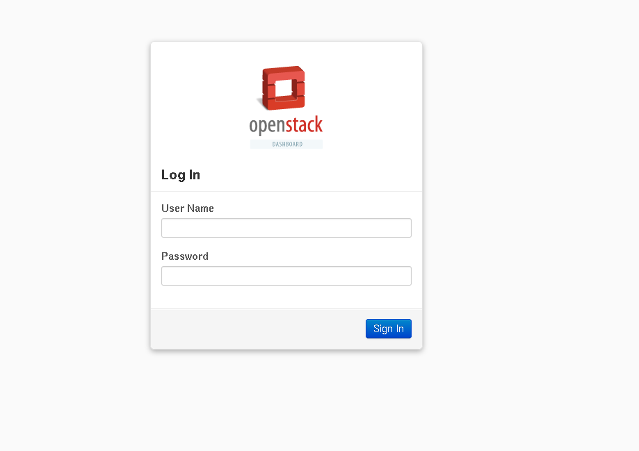

UserName: ONID username
Password: ID # (change this)

Setting Up
----------

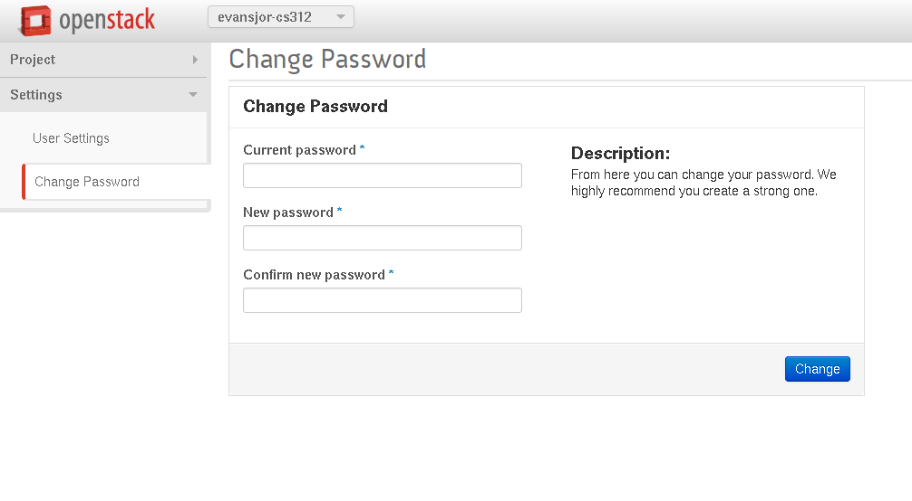

If you don't change your password, an automated script will be emailing you!

Setting Up
----------

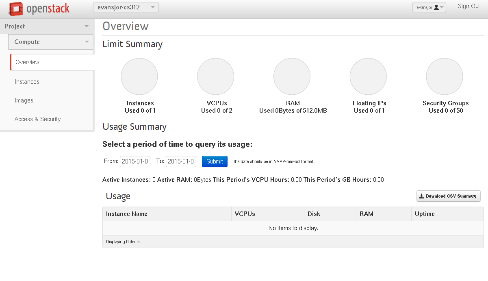

Setting Up
----------

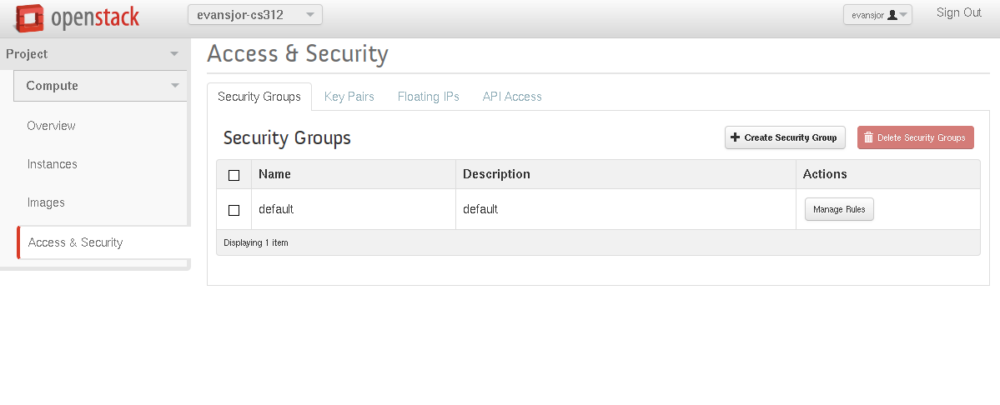

Next we need to set up a key pair. Click on Security (the page
in this picture) and then on Key Pairs

Setting Up
----------

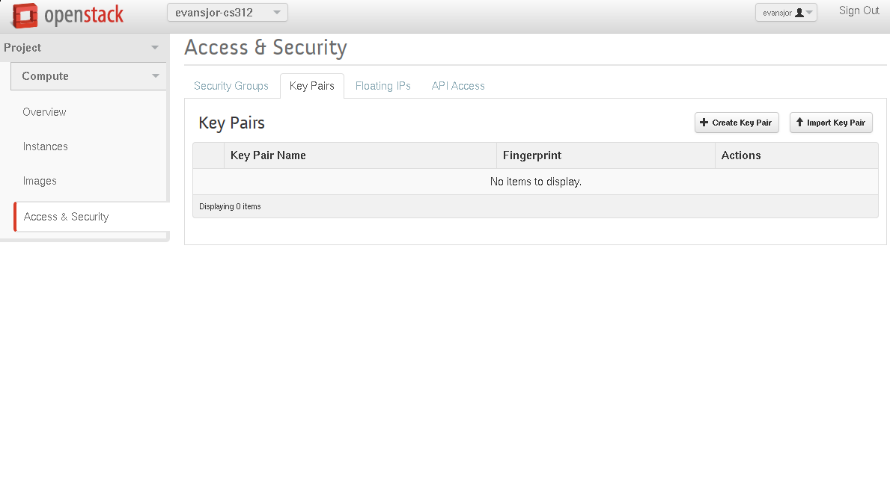

Click on Import Key Pair if you already have an SSH key
pair

Setting Up
----------

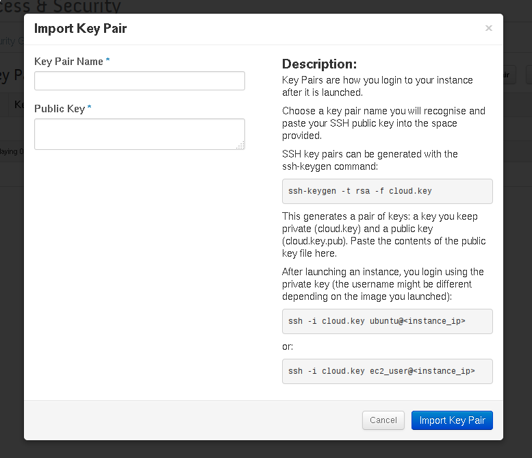

Setting Up
----------

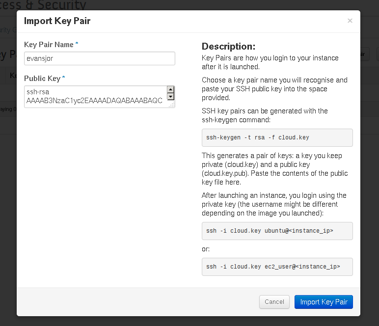

Setting Up
----------

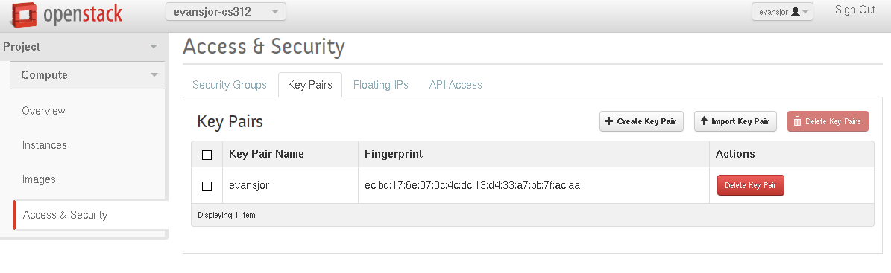

Setting Up
----------

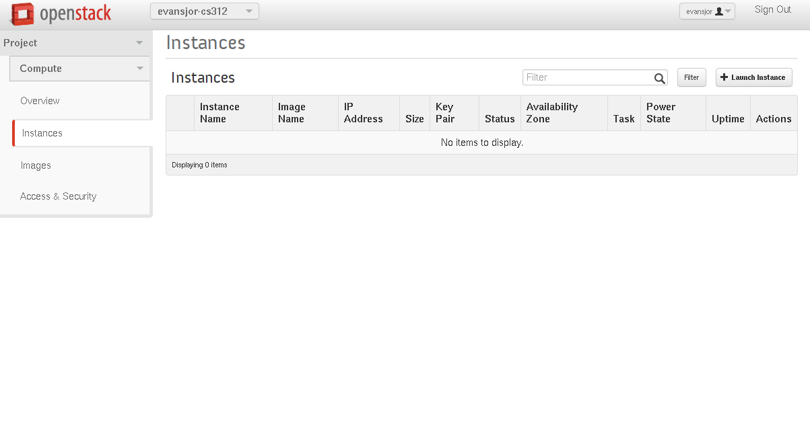

Setting Up
----------

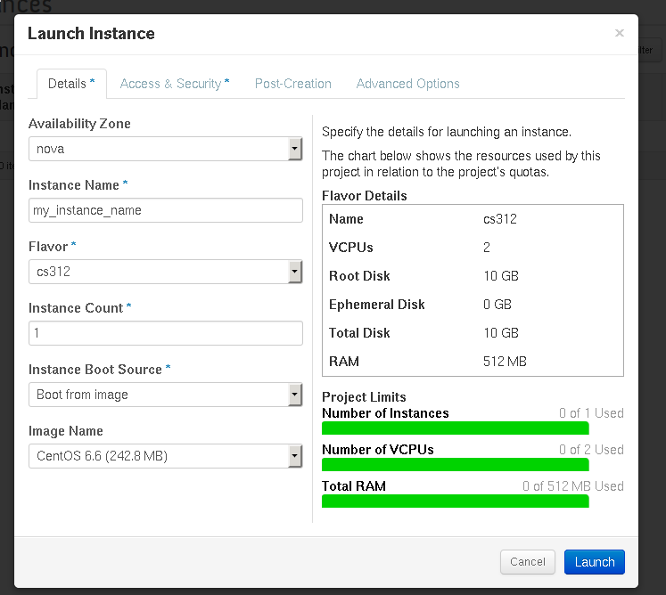

Setting Up
----------

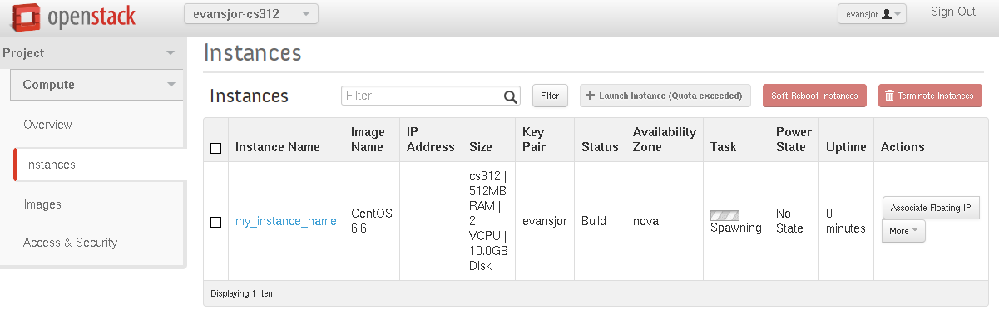

