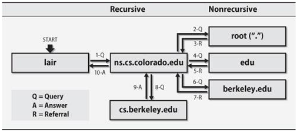
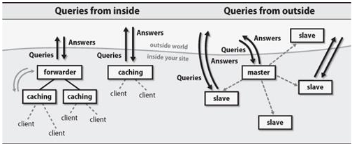

.. _17_dns:

Introductory DNS
================

What is DNS?
------------

* Domain Name System
* Hierarchical namespace for hosts and IP addresses
* Stored as a distributed Tree

Why is it Useful?
-----------------

* No remembering IP addresses
* Load balancing!
* MX routing records for email
* Decouples domains from their addresses
* A mechanism for finding services on a network
* Extensible with new record types (and many have been added)

DNS Delegation
--------------

* Recursive vs. Non-recursive
* Authoritative vs. Non-Authoritative

Querying DNS with dig
---------------------

* Domain Information Groper (dig) -- client tool that comes with Bind
* CentOS: ``bind-utils`` package
* Debian: ``dnsutils`` package

.. code-block:: bash

  # Lookup A record
  $ dig osuosl.org

  # Lookup PTR record
  $ dig -x 140.210.15.183

  # Lookup a specific record type
  $ dig TXT osuosl.org

  # Plus options to extend output
  $ dig +short osuosl.org

A Records
---------

They look like::

    osuosl.org.     300 IN  A   140.211.15.183

.. csv-table::
  :widths: 5, 30

  ``osuosl.org.``, Record being queried
  ``140.211.15.183``, The 'answer'
  ``300``, Time to Live (TTL) (expiration time)
  ``IN A``, DNS record type

* One can have more than one A record per domain

AAAA Records
------------

Same as **A**, but for IPv6.::

    google.com.		271	IN	AAAA	2607:f8b0:400a:805::100e

MX Records
----------

They look like::

    osuosl.org.     3600    IN  MX  5 smtp3.osuosl.org.
    osuosl.org.     3600    IN  MX  5 smtp4.osuosl.org.
    osuosl.org.     3600    IN  MX  5 smtp1.osuosl.org.
    osuosl.org.     3600    IN  MX  5 smtp2.osuosl.org.

* MX records have priority (in this example they are all the same)
* When sending email, the relay looks up the MX record and sends mail there.
* Lower number means higher priority

NS Records
----------

They look like::

    osuosl.org.     86258   IN  NS  ns1.auth.osuosl.org.
    osuosl.org.     86258   IN  NS  ns2.auth.osuosl.org.
    osuosl.org.     86258   IN  NS  ns3.auth.osuosl.org.

* They inform where to direct DNS queries for a domain
* Point to other domains (which have A records)
* Glue records are sometimes needed and provided to registrar

PTR Records
-----------

* Provides a reverse name mapping to an IP address
* IPv4 are shown in reverse order always end with ``in-addr.arpa``
* IPv6 are uses ``ip6.arpa``
* Why ``.arpa``?

  * Infrastructure top-level domain
  * *Address and Routing Parameter Area*

::

  $ dig -x 140.211.15.183
  ;; QUESTION SECTION:
  ;183.15.211.140.in-addr.arpa. IN  PTR

  ;; ANSWER SECTION:
  183.15.211.140.in-addr.arpa. 86400 IN PTR web1.osuosl.org.

PTR Record delegation
---------------------

* Always come from ISP

::

  ;; QUESTION SECTION:
  ;15.211.140.in-addr.arpa. IN  NS

  ;; ANSWER SECTION:
  15.211.140.in-addr.arpa. 86400  IN  NS  ns1.auth.osuosl.org.
  15.211.140.in-addr.arpa. 86400  IN  NS  ns2.auth.osuosl.org.
  15.211.140.in-addr.arpa. 86400  IN  NS  ns3.auth.osuosl.org.
  15.211.140.in-addr.arpa. 86400  IN  NS  ns1.nero.net.

Classless PTR delegation
------------------------

* Delegating networks smaller than /24 require `RFC2317`_

.. _RFC2317: https://www.ietf.org/rfc/rfc2317.txt

.. rst-class:: codeblock-very-small

::

  ;; QUESTION SECTION:
  ;10.169.211.140.in-addr.arpa. IN  NS

  ;; ANSWER SECTION:
  10.169.211.140.in-addr.arpa. 3600 IN  CNAME 10.0-63.169.211.140.in-addr.arpa.

  ;; QUESTION SECTION:
  ;0-63.169.211.140.in-addr.arpa. IN  NS

  ;; ANSWER SECTION:
  0-63.169.211.140.in-addr.arpa. 10800 IN NS  ns1.linux-foundation.org.
  0-63.169.211.140.in-addr.arpa. 10800 IN NS  ns2.linux-foundation.org.
  0-63.169.211.140.in-addr.arpa. 10800 IN NS  ns1.auth.osuosl.org.
  0-63.169.211.140.in-addr.arpa. 10800 IN NS  ns2.auth.osuosl.org.
  0-63.169.211.140.in-addr.arpa. 10800 IN NS  ns3.auth.osuosl.org.

  ;; QUESTION SECTION:
  ;10.169.211.140.in-addr.arpa. IN  PTR

  ;; ANSWER SECTION:
  10.169.211.140.in-addr.arpa. 3577 IN  CNAME 10.0-63.169.211.140.in-addr.arpa.
  10.0-63.169.211.140.in-addr.arpa. 86400 IN PTR  ns1.linux-foundation.org.

NXDOMAIN Records
----------------

* Tell you there is no answer to a query::

    Host something.invalid.osuosl.org not found: 3(NXDOMAIN)

* Some ISPs and others never serve NXDOMAINS

  * Instead they point you at themselves

The Root
--------

``.`` is the root of the DNS tree::

    $ dig ns .
    ;; ANSWER SECTION:
    .           512297  IN  NS  i.root-servers.net.
    .           512297  IN  NS  e.root-servers.net.
    .           512297  IN  NS  d.root-servers.net.
    .           512297  IN  NS  j.root-servers.net.
    .           512297  IN  NS  b.root-servers.net.
    .           512297  IN  NS  a.root-servers.net.
    .           512297  IN  NS  f.root-servers.net.
    .           512297  IN  NS  h.root-servers.net.
    .           512297  IN  NS  g.root-servers.net.
    .           512297  IN  NS  c.root-servers.net.
    .           512297  IN  NS  m.root-servers.net.
    .           512297  IN  NS  k.root-servers.net.
    .           512297  IN  NS  l.root-servers.net.

The Thirteen
------------

Thirteen Nameservers

* ``[a-m].root-servers.net``
* Information at http://www.root-servers.org
* ``a``, ``j`` are run by Verisign

The Thirteen
------------

  * Information Sciences Institute - USC
  * Cogent Communications
  * University of Maryland
  * NASA
  * Internet Systems Consortium
  * USA DOD
  * USA Army
  * Netnod (Autonomica) - Sweden
  * RIPE NCC
  * ICANN
  * WIDE - Japan

The Thirteen
------------

* Typically use Anycast
* Each runs on as few as 1 (USC) servers, or as many as 155 (ICANN)

.. figure:: ../_static/hedgehog.png
   :align: center

Authoritative (SOA)
-------------------

* A DNS server is **authoritative** if it has a Start of Authority (SOA) record for a domain
* The root-servers contain SOA records for the TLDs and gTLDs
* The NS servers for each (g)TLD contain SOA records for each registered domain
* and so on...

Recursive Example
-----------------

First we query a **NS** record for **.**::

    $ dig ns .
    ;; QUESTION SECTION:
    ;.              IN  NS

    ;; ANSWER SECTION:
    .           518400  IN  NS  i.root-servers.net.
    .           518400  IN  NS  a.root-servers.net.
    .           518400  IN  NS  l.root-servers.net.
    .           518400  IN  NS  f.root-servers.net.
    .           518400  IN  NS  b.root-servers.net.
    .           518400  IN  NS  d.root-servers.net.
    .           518400  IN  NS  k.root-servers.net.
    .           518400  IN  NS  g.root-servers.net.
    .           518400  IN  NS  h.root-servers.net.
    .           518400  IN  NS  m.root-servers.net.
    .           518400  IN  NS  e.root-servers.net.
    .           518400  IN  NS  c.root-servers.net.
    .           518400  IN  NS  j.root-servers.net.

Recursive Example
-----------------

Next we query **NS** for **org.**::

    $ dig ns com. @a.root-servers.net
    ;; QUESTION SECTION:
    ;org.               IN  NS

    ;; AUTHORITY SECTION:
    org.            172800  IN  NS  a0.org.afilias-nst.info.
    org.            172800  IN  NS  a2.org.afilias-nst.info.
    org.            172800  IN  NS  b0.org.afilias-nst.org.
    org.            172800  IN  NS  b2.org.afilias-nst.org.
    org.            172800  IN  NS  c0.org.afilias-nst.info.
    org.            172800  IN  NS  d0.org.afilias-nst.org.

    ;; ADDITIONAL SECTION:
    a0.org.afilias-nst.info. 172800 IN  A   199.19.56.1
    a2.org.afilias-nst.info. 172800 IN  A   199.249.112.1
    b0.org.afilias-nst.org. 172800  IN  A   199.19.54.1
    b2.org.afilias-nst.org. 172800  IN  A   199.249.120.1
    <truncated>

Recursive Example
-----------------

Next we query **NS** for **osuosl.org.**::

    $ dig ns osuosl.org. @199.19.56.1
    ;; QUESTION SECTION:
    ;osuosl.org.            IN  NS

    ;; AUTHORITY SECTION:
    osuosl.org.     86400   IN  NS  ns3.auth.osuosl.org.
    osuosl.org.     86400   IN  NS  ns2.auth.osuosl.org.
    osuosl.org.     86400   IN  NS  ns1.auth.osuosl.org.

    ;; ADDITIONAL SECTION:
    ns1.auth.osuosl.org.    86400   IN  A   140.211.166.140
    ns2.auth.osuosl.org.    86400   IN  A   140.211.166.141
    ns3.auth.osuosl.org.    86400   IN  A   216.165.191.53

Recursive Example
-----------------

Next we query **A** for **osuosl.org.**::

    $ dig a osuosl.org. @140.211.166.140
    ;; QUESTION SECTION:
    ;osuosl.org.            IN  A

    ;; ANSWER SECTION:
    osuosl.org.     300 IN  A   140.211.15.183

    ;; AUTHORITY SECTION:
    osuosl.org.     86400   IN  NS  ns1.auth.osuosl.org.
    osuosl.org.     86400   IN  NS  ns2.auth.osuosl.org.
    osuosl.org.     86400   IN  NS  ns3.auth.osuosl.org.

    ;; ADDITIONAL SECTION:
    ns1.auth.osuosl.org.    86400   IN  A   140.211.166.140
    ns2.auth.osuosl.org.    86400   IN  A   140.211.166.141
    ns3.auth.osuosl.org.    3600    IN  A   216.165.191.53

Recursive Example
-----------------

That was a lot of work, so we have dns caches to help us:

  * bind
  * unbound
  * dnscache ({n,}djbdns)

CNAME Records
-------------

Canonical Name is the thing pointed at, query is what points to it::

    ;; QUESTION SECTION:
    ;www.osuosl.org.          IN A

    ;; ANSWER SECTION:
    www.osuosl.org.     86399 IN CNAME web1.osuosl.org.
    web1.osuosl.org.    86400 IN A     140.211.15.183

CNAME Records
-------------

* Query for A, get A record.

* Query for CNAME, get the canonical name (NOT the ip address)
* CNAME records can be problematic

TXT Records
-----------

* Arbitrary text record
* Used by some applications for specific purposes

::

  ;; QUESTION SECTION:
  ;oregonstate.edu.   IN  TXT

  ;; ANSWER SECTION:
  oregonstate.edu.  3600  IN  TXT "MS=ms62624237"
  oregonstate.edu.  3600  IN  TXT "adobe-idp-site-verification=fe492d09-19f1-47e9-9d04-30fe92a03e4f"
  oregonstate.edu.  3600  IN  TXT "c6PyBr5dTRwVyn5t8h0JUm5vIh/+dL1yECXbGzwMb5D9pq9w02DSh81vaWJyg8ulAX4ZaEkMXQymvdMIZYvUvQ=="
  oregonstate.edu.  3600  IN  TXT "v=spf1 include:_spf.oregonstate.edu include:_spf.google.com include:spf.protection.outlook.com ?all"

resolv.conf
-----------

resolv.conf has ``nameserver`` entries which tell which dns servers to use::

    nameserver 140.211.166.130
    nameserver 140.211.166.131

Most distributions provide a package that manages resolv.conf entries when using dhcp (typically called resolvconf)

Types of DNS servers
--------------------

**Authoritative**

* Master or Primary
* Slave or Secondary
* Hidden Masters
* Typically setup as Non-Recursive

**Non-Authoritative**

* Caching
* Forwarder
* Typically setup as Recursive

DNS Server Architecture
-----------------------

Authoritative Servers
---------------------

* Answer authoritatively for your domain
* Need to be very secure
* Best to have at least two or more servers
* Geographically and logically separately
* Ideally disable recursive requests
* Hidden master isn't publicly accessible
* Slaves get zone transfers from master via notifies

Non-Authoritative Servers
-------------------------

* Does a recursive lookup going through the DNS hierarchy
* Typically caching or recursive servers *(What you tell your clients to use)*
* Forwarders pass requests to other dns servers
* Limit access and use of caching server to only your subnets!

DNS Caching
-----------

* Time To Live (TTL) tells caching servers how long to keep the record
* Not all DNS servers follow the RFC properly, so use with care
* Lower TTL typically means more traffic to your authoritative server
* Good default is for 1 day for records that don't change
* Five minutes is good for records you'd like to change quickly
* Plan ahead if changing or migrating a service!!!

Zonefile Commands
-----------------

* Zones are typically domains
* Three standard commands: ``$ORIGIN``, ``$INCLUDE`` and ``$TTL``
* Zone files are parsed top to bottom

.. csv-table::
  :widths: 15, 10

  ``$ORIGIN domain-name``, "Default domain for the file"
  ``$INCLUDE filename [origin]``, "Include a specific file"
  ``$TTL default-ttl``, "Default time-to-live for all records"

Bind Zone File Basics
---------------------

::

  $ORIGIN example.org
  $TTL 600
  example.org IN SOA ns1.example.org. webmaster.example.org (
    2015011501    ; serial
    3600          ; refresh (1 hour)
    3600          ; retry (1 hour)
    604800        ; expire (1 week)
    600           ; TTL (10 minutes )
    )

        NS    ns1.example.org
        NS    ns2.example.org

  ns1   A     192.168.1.1
  ns2   A     192.168.100.1
  @     A     192.168.1.10
  www   A     192.168.1.10
  foo   CNAME www.example.org

DHCP
====

How do you get an address without an address?
---------------------------------------------

* Broadcast::

    # DISCOVER
    UDP Src=0.0.0.0 sPort=68
    Dest=255.255.255.255 dPort=67

    # OFFER
    UDP Src=192.168.1.1 sPort=67
    Dest=255.255.255.255 dPort=68
    # Offer message contains clients MAC, offered IP, subnet mask,
    # and lease duration

Broadcast Continued
-------------------

::

    # REQUEST
    UDP Src=0.0.0.0 sPort=68
    Dest=255.255.255.255 dPort=67
    # Client accepts one OFFER. All servers that sent an offer that are
    # not this offer rescind their offers.

    # ACK
    UDP Src=192.168.1.1 sPort=67
    Dest=255.255.255.255 dPort=68

Types of Address Allocations
----------------------------

* Automatic

  * No lease

* Dynamic

  * "Standard" way, including lease

* Static

  * MAC addresses are known ahead of time

These are often mixed in some fashion, like using **Automatic** with a table
of static MAC addresses that have been reserved ahead of time.
