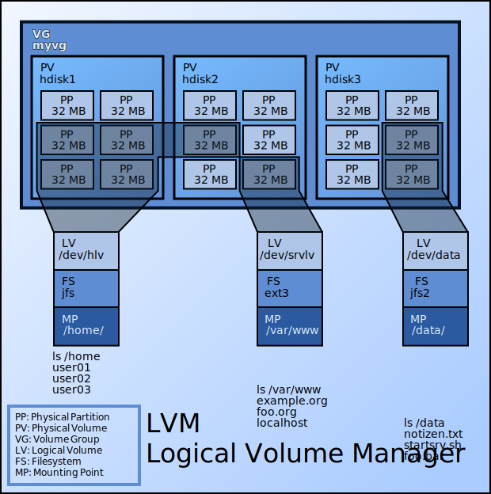
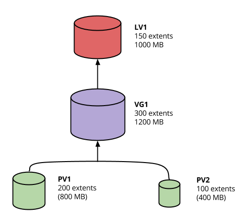

.. _05_linux_basics:

Storage & Automated OS Install
==============================

Storage
=======

Virtualizing storage
--------------------

* Partitions have limitations
* Storage needs to be flexible
* Large storage management

  * Adding, removing, expanding storage hot swap

Utilizing storage more efficiently
----------------------------------

* Grow the storage as needed
* Only allocate the minimum you need
* Expect to make changes to your storage later
* Fully utilize the physical media

Storage Snapshots
-----------------

* Perform consistent backups atomically

LVM
---

Logical Volume Manager

Components of LVM
-----------------

.. csv-table::
  :header: Name, Description

  Physical Volume (PV), physical device (typically a hdd)
  Volume Group (VG), Collection of PV's
  Logical Volume (LV), Slice of a VG to create a partition
  Physical Extent (PE), Chunks of data in a PV with the same size
  Logical Extent (LE), Chunks of data in a LV with the same size

`LVM Howto`_ (a bit dated, but still relevant)

.. _LVM Howto: http://tldp.org/HOWTO/LVM-HOWTO/

LVM Example
-----------

.. rst-class:: build

#. Two disk partitions: sda1 (800MB) & sdb1 (400MB)
#. Format each partition into a PV
#. The PV's are divided up into 4MB chunks (PE): sda1 (200PE) / sdb1 (100PE)
#. Create a VG using sda1 and sda2
#. Create an LV of size 1GB (uses linear mapping by default)
#. Total of 250 LE's are required
#. 200PE's are used in sda1, 50PE's are used in sdb1, 50PE are free
#. Create a filesystem from the LV and mount it
#. PROFIT!

LVM Visualized
--------------

LVM commands
------------

.. code-block:: bash

  $ yum install lvm2

  # Note: I created loop1/2 using dd and losetup
  $ pvcreate /dev/loop1 /dev/loop2
    Physical volume "/dev/loop1" successfully created
    Physical volume "/dev/loop2" successfully created

  $ vgcreate lvm /dev/loop1 /dev/loop2
    Volume group "lvm" successfully created

  $ lvcreate -n home -L 1G lvm
    Logical volume "home" created

  $ mkfs.ext4 /dev/lvm/home
  $ mount /dev/lvm/home /mnt

LVM commands
------------

All commands start with ``pv``, ``vg`` or ``lv``

::

  pvchange   pvcreate   pvmove     pvresize   pvscan
  pvck       pvdisplay  pvremove   pvs

  vgcfgbackup    vgconvert      vgextend       vgmknodes      vgs
  vgcfgrestore   vgcreate       vgimport       vgreduce       vgscan
  vgchange       vgdisplay      vgimportclone  vgremove       vgsplit
  vgck           vgexport       vgmerge        vgrename

  lvchange     lvextend     lvmdiskscan  lvmsar       lvresize
  lvconvert    lvm          lvmdump      lvreduce     lvs
  lvcreate     lvmchange    lvmetad      lvremove     lvscan
  lvdisplay    lvmconf      lvmsadc      lvrename

Useful tricks with LVM
----------------------

* Move LE's between PV's (linear vs. striped problem)
* Move from one PV to another PV live
* Rename VG's or LV's live
* Reduce, remove or add LV's as needed
* Make atomic snapshots for backups

Issues with LVM
---------------

* Requires an initrd if the rootfs is in lvm

  * Can be make troubleshooting difficult sometimes

* Can't move LV's between VG's
* If a disk dies, all the PE's are gone (unless RAID is used in LVM)
* Using LVM inside of LVM can be hard to troubleshoot

  * Ganeti VMs

RAID
-----

**Software (mdadm or LVM)**

* sda1/sda2 -> md0 -> PV -> VG -> LV - > filesystem
* sda1/sda2 -> PV -> VG -> -LV (raid#) -> filesystem
* mdadm + lvm usually preferred
* Performance has improved quite a bit over the years

**Hardware**

* Dedicated hardware to RAID
* Prevent boot problems that mdadm may have
* Proprietary tools
* Claim better performance

RAID Levels
-----------

.. csv-table::
  :header: Level, Minimum disks, Description

  RAID0, 2, Striping
  RAID1, 2, Mirroring
  RAID5, 3, Block-level striping with distributed parity
  RAID6, 4, Block-level striping with double distributed parity
  RAID10/RAID1+0, 4, Striped set from a series of mirrored drives

*Hot spares can automate rebuilds (i.e. RAID5+1 & RAID6+1)*

RAID Issues
-----------

* Complicate data recovery
* HW Controller limitations and cost
* HW management utility differences
* Multiple disk failures during rebuild
* Performance

Automate OS Installation
========================

Ideal Requirements
------------------

*These are not entirely required, but makes it a lot easier*

* Working DHCP environment
* Network booting capable hardware (i.e. PXE)
* TFTP boot server
* HTTP or NFS server for serving kickstart files

Automated install steps
-----------------------

#. System start up, BIOS check
#. Boot from network device (i.e. `PXE`_)
#. Gets an IP address and information on where the boot server is
#. Grabs the initial boot image (i.e. `syslinux`_)
#. Downloads Linux kernel/initrd image
#. The boot command includes a pointer to a kickstart (ks) file

Automated install steps
-----------------------

#. System boots up, tries to get an IP address and attempts to download the ks
   file.
#. Using the ks file, installs the systems. If the ks file doesn't answer all
   needed questions, installation will stop for user interaction.
#. Install with finish and may reboot or shutdown depending on the ks file

.. _PXE: http://en.wikipedia.org/wiki/Preboot_Execution_Environment
.. _syslinux: http://en.wikipedia.org/wiki/SYSLINUX

Anaconda / Kickstart
--------------------

`Anaconda`_ is the installation program used by Redhat derivatives

* Provides a text or GUI frontend for users to interact with
* Sets up initial storage, installs base system, sets up initial users

`Kickstart`_ is the automation method to install Redhat machines

* Simple and easy to use configuration file format
* Can be served using a variety of methods (i.e. http)
* Extremely configurable and useful for most environment needs

.. _Anaconda: http://fedoraproject.org/wiki/Anaconda
.. _Kickstart: http://fedoraproject.org/wiki/Anaconda/Kickstart

ks.cfg
------

.. rst-class:: codeblock-sm

::

  install
  cdrom
  lang en_US.UTF-8
  keyboard us
  network --bootproto=dhcp
  rootpw cs312
  firewall --disabled
  selinux --permissive
  timezone UTC
  unsupported_hardware
  bootloader --location=mbr
  text
  skipx
  zerombr
  clearpart --all --initlabel
  autopart
  auth --enableshadow --passalgo=sha512 --kickstart
  firstboot --disabled
  poweroff
  user --name=cs312 --plaintext --password cs312

  %packages --nobase
  sudo
  %end

Boot using the ks.cfg
---------------------

* Download `CentOS 6.6 Minimal ISO`_ (we also have USB sticks with it)
* Setup a VM using defaults
* Boot it up using the ISO image
* Press ``ESC`` to get the boot prompt
* Type:

::

  linux ks=http://cs312.osuosl.org/_static/ks.cfg

* Change boot order to hard disk
* Boot up!

.. _CentOS 6.6 Minimal ISO: http://centos.osuosl.org/6/isos/x86_64/CentOS-6.6-x86_64-minimal.iso

LVM and Kickstart
-----------------

.. code-block:: bash

  # Create /boot on sda1 with a 512MB size formatted as ext4
  part /boot --fstype="ext4" --size=512

  # Create a PV partition using the rest of the disk
  # 100 implies 100% in this case instead of size in MB
  part pv.01 --grow --size=100

  # Create a VG named lvm
  volgroup lvm pv.01

  # Create an LV named swap using the recommended size and format it
  # as swap
  logvol swap --vgname=lvm --name=swap --fstype="swap" --recommended

  # Create a rootfs named root 20GB in size and format it as ext4
  logvol / --vgname=lvm --name=root --fstype="ext4" --size=20480

Other useful ks features
------------------------

.. code-block:: bash

  # Set mirror for installation
  url --url=http://centos.osuosl.org/6/os/x86_64/

  # Add updates repo too
  repo --name=updates --baseurl=http://centos.osuosl.org/6/updates/x86_64/

  # Setup the installer in a VNC session using a password
  vnc --password=cs312

  # Run misc commands after the OS install
  %post --interpreter /bin/bash --log=/root/post-install.log
  echo "%cs312 ALL=(ALL) NOPASSWD: ALL" >> /etc/sudoers
  %end

Exercise #1
-----------

* Use the ks configuration `ks.cfg`_ from the previous slide and install the
  system
* http://cs312.osuosl.org/_static/ks.cfg

.. _ks.cfg: http://cs312.osuosl.org/_static/ks.cfg

Exercise #2
-----------

* Using `Github Gists`_, create a ``ks.cfg`` file using the previous
  configuration `ks.cfg`_
* Modify it to do the following instead:

  * Remove ``autopart`` and replace it with a 512M swap partition and the rest
    as the rootfs as the second partition (i.e. no LVM)
  * Add a post install script which allows the cs312 user full sudo

* Feel free to use a URL shortener service such as http://goo.gl to make it
  easier to type

**NOTE: You need to add noverifyssl to the ks line when using gists**

.. _Github Gists: https://gist.github.com/
.. _ks.cfg: http://cs312.osuosl.org/_static/ks.cfg

Resources
---------

* http://tldp.org/HOWTO/LVM-HOWTO/
* http://fedoraproject.org/wiki/Anaconda
* http://fedoraproject.org/wiki/Anaconda_Boot_Options
* http://fedoraproject.org/wiki/Anaconda/Kickstart
