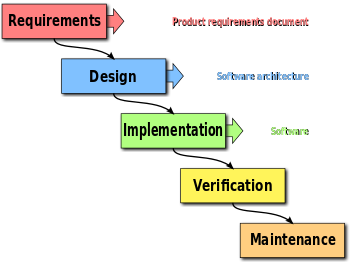

.. _07_agile_methods:

Agile Methodologies
===================

Agile Methodologies
-------------------

In general, agile development methodologies involve:

* Iteration of process
* Short cycles
* Fast feedback
* Parallel execution of various stages
* Less documentation-focused

Contrast
--------

First, lets talk about waterfall in order to contrast agile methodologies:

* One cycle
* Sequential
* Entire project progesses through stages

Contrast
--------

Agile methodologies shorten this cycle so that each cycle is focused on a
group of features rather than the entire project

.. figure:: ../_static/scrum.svg

Scrum
-----

* Based on the principle that project requirements change frequently
* Unpredicted challenges cannot be planned for
* 3 roles: Product Owner, Developers, Scrum Master

Product Owner (Scrum)
---------------------

* Primarily responsible for communications outside the team
* Communicate with stakeholders, clients, and development team
* Common tasks include:

  * Demonstrating the product
  * Announcing releases, milestones
  * Prioritizing development efforts
  * Worries about scheduling, deadlines, funding, etc.

In general, a product owner shields the rest of the team from
non-technical issues that could hamper development of the product.

Development Team
----------------

* Delivers iterative code releases
* Works in sprints (typically 2-4 weeks)
* Relatively self-organizing
* Includes development, operations, QA, other technical interests
* Works with Product Owner to deliver on goals and deadlines

Scrum Master
------------

* Facilitates the scrum process
* Buffers the development team from distractions
* Leads meetings, sprints, reviews, and other events
* Generally doesn't manage a team
* May work with multiple products

Sprint
------

* An iteration of a cycle
* Typically 2-4 weeks
* Starts with a planning meeting where development team
  commits to goals for the particular sprint
* Ends with a retrospective

Sprint Backlog
--------------

* List of features, bugs, and other tasks to be done
* Typically sorted by priority
* Tasks are often called user stories: "as a user I want to ..."
* Each task gets assigned a number of story-points

  * Roughly an estimate of time to do task and difficulty
  * Each sprint has a set number of story points

Sprint Planning Meeting
-----------------------

* Select user stories to complete during the upcoming sprint
* Re-order task list by priority if things have changed
* Typically 1-2 hours per week of sprint length (so 4-8 hours)
* Identify any issues that block stories from being completed

Standup (Daily Meeting)
-----------------------

* Very short; typically 15 minutes
* Development team members go around, briefly mention tasks they are working on

  * Also discuss blockers, if applicable
  * No discussion of implementation details, this is solely for informing other
    team members of what you are working on

* Typically done standing up

Review Meeting
--------------

* Happen once at the end of a sprint
* Review completed work
* Demo completed work to interested parties
* Review why incomplete work was not completed

Retrospective Meeting
---------------------

* Happen once at the end of a sprint
* Team members retrospect on the previous sprint
* Typically answers "What went will?" and "What didn't go well?"
* Necessary adjustments discussed to make the next sprint better
* Facilitated by scrum master
* Development Team members only, no leadership

