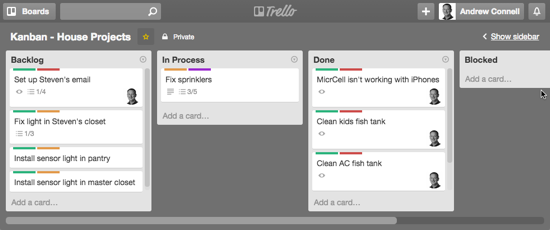

.. _07_agile_methods:

Agile Methodologies
===================

Importance to Ops
-----------------

* Encourages DevOps and team integration
* Agile methods acknowledge unplannable events
* Brings Ops earlier into the cycle than other methodologies

Agile Methodologies
-------------------

In general, agile development methodologies involve:

* Iteration of process
* Short cycles
* Fast feedback
* Parallel execution of various stages
* Less documentation-focused
* Timeboxing (Limiting time spent)

Contrast
--------

First, lets talk about waterfall in order to contrast agile methodologies:

* One cycle
* Sequential
* Entire project progesses through stages

.. figure:: ../_static/waterfall.png

   image from `wikipedia`__

.. __: http://upload.wikimedia.org/wikipedia/commons/e/e2/Waterfall_model.svg

Contrast
--------

Agile methodologies shorten this cycle so that each cycle is focused on a
group of features rather than the entire project

.. figure:: ../_static/scrum.svg

   image from `wikipedia`__

.. __: http://upload.wikimedia.org/wikipedia/commons/5/58/Scrum_process.svg

Scrum
=====

History
-------

* Invented in 1986 by Hirotaka Takeuchi and Ikujiro Nonaka
* Parallel as opposed to sequential process
* Designed to increase flexibility
* Rose to prominence in the 2000s with the creation of Scrum master
  certification

Summary
-------

* Sprint planning
* Sprint happens
* Sprint Review
* Sprint Retrospective
* New Sprint planning

Scrum
-----

* Based on the principle that project requirements change frequently
* Unpredicted challenges cannot be planned for
* 3 roles: Product Owner, Developers, Scrum Master

Product Owner (Scrum)
---------------------

* Primarily responsible for communications outside the team
* Communicate with stakeholders, clients, and development team
* Common tasks include:

  * Demonstrating the product
  * Announcing releases, milestones
  * Prioritizing development efforts
  * Worries about scheduling, deadlines, funding, etc.

*In general, a product owner shields the rest of the team from*
*non-technical issues that could hamper development of the product.*

Development Team
----------------

* Delivers iterative code releases
* Works in sprints (typically 2-4 weeks)
* Relatively self-organizing
* Includes development, operations, QA, other technical interests
* Works with Product Owner to deliver on goals and deadlines

Scrum Master
------------

* Facilitates the scrum process
* Buffers the development team from distractions
* Leads meetings, sprints, reviews, and other events
* Generally doesn't manage a team
* May work with multiple products

Sprint
------

* An iteration of a cycle
* Typically 2-4 weeks
* Starts with a planning meeting where development team
  commits to goals for the particular sprint
* Ends with a retrospective

Sprint Backlog
--------------

* List of features, bugs, and other tasks to be done
* Typically sorted by priority
* Tasks are often called user stories: "as a user I want to ..."
* Each task gets assigned a number of story-points

  * Roughly an estimate of time to do task and difficulty
  * Each sprint has a set number of story points

Sprint Planning Meeting
-----------------------

* Select user stories to complete during the upcoming sprint
* Re-order task list by priority if things have changed
* Typically 1-2 hours per week of sprint length (so 4-8 hours)
* Identify any issues that block stories from being completed

Standup (Daily Meeting)
-----------------------

* Very short; typically 15 minutes
* Development team members go around, briefly mention tasks they are working on

  * Also discuss blockers, if applicable
  * No discussion of implementation details, this is solely for informing other
    team members of what you are working on

* Typically done standing up

Review Meeting
--------------

* Happen once at the end of a sprint
* Review completed work
* Demo completed work to interested parties
* Review why incomplete work was not completed

Retrospective Meeting
---------------------

* Happen once at the end of a sprint
* Team members retrospect on the previous sprint
* Typically answers "What went will?" and "What didn't go well?"
* Necessary adjustments discussed to make the next sprint better
* Facilitated by scrum master
* Development Team members only, no leadership

Summary
-------

* Sprint planning
* Sprint happens
* Sprint Review
* Sprint Retrospective
* New Sprint planning

Criticisms
----------

* Poor documentation (often out of date or nonexistent)
* Moving goalposts; no well defined target
* Large number of meetingts near beginning/end of sprint (but few in between)
* encourages "box checking"; focuses too much on time-estimations

Kanban
======

Kanban
------

* Emphasises just-on-time delivery
* Based on the lean manufacturing process Toyota uses
* Is an evolution of existing methodologies
* Does not prescribe a specific set of steps

Workflow
--------

* Understand that Software Development is primarily a knowledge-creation
  activity
* Introspect the existing workflow of how the desires of a customer becomes
  a part of the creation
* Recognize that knowledge creation includes variation, randomness, and requires
  adaptation
* Examine bottlenecks of the workflow (queues & batches)
* Examine the failures and why they failed.

Visualisation
-------------

* Kanban uses visualisation as a tool to introspect the workflow process
* Is called a Kanban Board
* Visualizes the steps through which a task is realized
* Helps quantize the workflow

   A Trello Kanban board, image from `this blog`__

.. __: http://www.andrewconnell.com/blog/\
       project-task-management-using-trello-for-kanban-boards

Work In Process
---------------

* Pull signal instead of scheduled
* Measured in cycle-time (how long from beginning to end?)
* Measures a teams work through-put
* Often examined using queueing theory or traffic flow analysis
* Littles Lemma: Cycle Time = Queue length / Avg time spent in queue

  * This means we can reduce cycle-time by reducing the queue length
    or by reducing the average time spent in queues
  * Reducing queue length can also cause problems; cycle overhead becomes
    a more significant portion of time spent on project.

Cadence
-------

* Similar to Scrum's sprint
* Often established using Agile's timeboxing
* Are usually harmonic
* Enables predictability

Adaptation
----------

* Kanban is a self-introspecting process designed to adapt as the situation
  changes
* Focuses on reducing Cycle Time and WIP limits

Scrumban
--------

* A modified version of scrum to fit operations better
* A number of story points are saved for unplannable issues
* Kanban board is used to track tasks
* Introspects unplanned vs planned work
