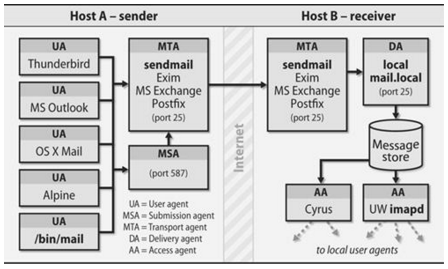
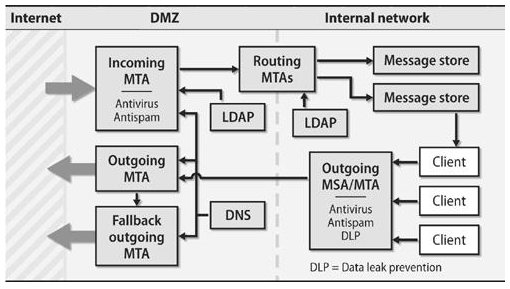

.. _10_nfs_ldap_email:

NFS, LDAP, Email
================

NFS: Network File System
========================

NFS Basics
----------

* Share files over the network
* Originally created by Sun Microsystems in 1984
* Performance & Security concerns
* Most commonly used share protocol on Linux

NFS versions
------------

.. rst-class:: build

**NFSv2**
  Released in 1989 and only used UDP. Had several issues include 32bit filesize
  limitations as well as performance & security issues. Should not be used
  today.
**NFSv3**
  Released in 1995, has support for either UDP or TCP and improves performance,
  large file support and other various fixes on the protocol. Still in use
  today.
**NFSv4**
  Released in 2000, only supports TCP and was a major overhaul of the protocol.
  Version 4.1 was released in 2010 to provide support for clustered deployments.
  Most servers should be using at least v3 or v4 today.

NFS v4 major improvements
-------------------------

* Better support for using NFS with firewalls and NAT networks
* Stateful operation
* Strong, integrated security
* Support for replication and migration
* Support for both Linux and Windows clients
* Access Control List (ACL) support
* Good performance even on low-bandwidth networks

NFS: Stateless vs. Stateful
---------------------------

.. rst-class:: build

**Version 2 & 3**
  * Stateless
  * Server cannot track which clients have a volume mounted
  * Uses a cookie
**Version 4**
  * Stateful
  * When the server fails, client assists in the recovery
  * Returning server waits for clients before permitting new operations and
    locks
  * Does not use the cookie system

NFS: Security
-------------

* V2/V3 are generally viewed as inherently insecure
* NFS originally designed with no security in mind
* V4 introduced much improvements

.. csv-table::
  :widths: 5, 10

  ``AUTH_NONE``, no authentication
  ``AUTH_SYS``, UNIX-style user and group access control
  ``RPCSEC_GSS``, "a powerful flavor that ensures integrity and privacy in
  addition to authentication"

Kerberos integration provides the additional layer of security in V4.

NFS: Server-side daemons
------------------------

*On CentOS 7 machines*

.. rst-class:: build

``nfs``
  NFS server and appropriate RPC services
``nfslock``
  Mandatory service that starts the appropriate RPC processes allowing NFS
  clients to lock files on the server
``rpcbind``
  Accepts port reservations from local RPC services. Not used with NFSv4.
``rpc.mountd``
  This process is used by an NFS server to process ``MOUNT`` requests from NFSv3
  clients.

NFS: Server-side daemons
------------------------

.. rst-class:: build

``rpc.nfsd``
  Allows explicit NFS versions and protocols the server advertises to be defined
``lockd``
  Implements the Network Lock Manager (NLM) protocol, which allows NFSv3 clients
  to lock files on the server
``rpc.statd``
  Implements the Network Status Monitor (NSM) RPC protocol, which notifies NFS
  clients when an NFS server is restarted without being gracefully brought down.

NFS: Server-side daemons
------------------------

.. rst-class:: build

``rpc.rquotad``
  Provides user quota information for remote users
``rpc.idmapd``
  Provides NFSv4 client and server upcalls, which map between on-the-wire NFSv4
  names (strings in the form of ``user@domain``) and local UIDs and GIDs

The ``/etc/exports`` Configuration file
---------------------------------------

Controls which file systems are exported to remote hosts and specifies options.
It follows the following syntax rules:

.. rst-class:: build

* Blank lines are ignored
* To add a comment, start a line with the hash mark (``#``)
* You can wrap long lines with a backslash (``\``)
* Each exported file system should be on its own individual line
* Any lists of authorized hosts placed after an exported file system must be
  separated by space characters
* Options for each of the hosts must be placed in parentheses directly after the
  host identifier, without any spaces separating the host and the first
  parenthesis

``/etc/exports``
----------------

::

  export host(options)
  # multiple hosts
  export host1(options) host2(options) host3(options)

.. rst-class:: build

``export``
  The directory being exported
``host``
  The host or network to which the export is being shared
``options``
  The options to be used for ``host``

See ``man exports`` for more options

``/etc/exports`` -- Hostname formats
------------------------------------

**Single Machine**
  A fully-qualified domain name (that can be resolved by the server), hostname
  (that can be resolved by the server), or an IP address.
**Series of machines specified with wildcards**
  Use the ``*`` or ``?`` character to specify a string match. Wildcards are not
  to be used with IP addresses. Does not include sub-domains of a wildcard.

``/etc/exports`` -- Hostname formats
------------------------------------

**IP networks**
  Use ``a.b.c.d/z``, where ``a.b.c.d`` is the network and ``z`` is the number of
  bits in the netmask (for example ``192.168.0.0/24``)
**Netgroups**
  Use the format ``@group-name``, where group-name is the NIS netgroup name.

``/etc/exports`` -- Default options
-----------------------------------

``ro``
  The exported file system is read-only.
``sync``
  The NFS server will not reply to requests before changes made by previous
  requests are written to disk. To enable asynchronous writes instead, specify
  the option ``async``.
``wdelay``
  The NFS server will delay writing to the disk if it suspects another write
  request is imminent.
``root_squash``
  This prevents root users connected remotely (as opposed to locally) from
  having root privileges; instead, the NFS server will assign them the user ID
  ``nfsnobody``.

``/etc/exports`` -- Gotchas
---------------------------

These do not mean the same thing!

::

  /data foo.example.com(rw)
  /data foo.example.com (rw)

.. rst-class:: build

* First line allows only users from ``foo.example.com`` read/write access to the
  ``/data`` directory
* Second line allows users from ``foo.example.com`` to mount the directory as
  read-only (the default), while the rest of the world can mount it read/write

Discovering NFS Exports
-----------------------

First, on any server that supports NFSv2 or NFSv3, use the ``showmount``
command:

.. rst-class:: build

.. code-block:: bash

  $ showmount -e foo.example.com
  Export list for foo.example.com
  /data/foo
  /data/bar

Second, on any server that supports NFSv4, mount / and look around:

.. rst-class:: build

.. code-block:: bash

  $ mount foo.example.com:/ /mnt/
  $ cd /mnt
  data
  $ ls data
  foo
  bar

LDAP: Lightweight Directory Access Protocol
===========================================

LDAP
----

Database service that makes a few assumptions:

* Data objects are small
* Database will be widely replicated and cached
* The information is attribute based
* Data is read often, but rarely written
* Searching is a common operation

LDAP Use Cases
--------------

* Central information about your users
* Distribute configuration details (i.e. email)
* Application authentication
* Changes take effect immediately and instantly visible
* Excellent CLI and web tools available
* Well supported public directory service
* Microsoft Active Directory uses LDAP as a base for its service

LDIF: LDAP Data Interchange Format
----------------------------------

Simplified example which expresses ``/etc/passwd``:

::

  uid: john
  cn: John Doe
  userPassword: {crypt}$sa3tHJ3/KuYvI
  loginShell: /bin/bash
  uidNumber: 1000
  gidNumber: 1000
  homeDirectory: /home/john

LDAP Hierarchy
--------------

::

  dn: uid=john,ou=People,dc=oregonstate,dc=edu

* Distinguished Name (dn) is the unique search path for an entry
* Data can be organized in a hierarchy similar to DNS
* *"most significant bit"* goes on the right
* Entries are typically schematized through the use of the ``objectClass``
  attribute

LDAP Packages
-------------

``openldap``
  A package containing the libraries necessary to run the OpenLDAP server and
  client applications.
``openldap-clients``
  A package containing the command line utilities for viewing and modifying
  directories on an LDAP server.
``openldap-servers``
  A package containing both the services and utilities to configure and run an
  LDAP server. This includes the Standalone LDAP Daemon, ``slapd``.
``nss-pam-ldapd``
  A package containing ``nslcd``, a local LDAP name service that allows a user
  to perform local LDAP queries.

LDAP Server
-----------

.. code-block:: bash

  # Install server package
  $ yum install openldap-servers

  # Start the service
  $ systemctl slapd start

  # Do a simple search
  $ ldapsearch -x -b '' -s base '(objectclass=*)' namingContexts

* ``slapd`` -- Stand-alone LDAP Daemon
* Next steps are to import initial entries and schemas into LDAP
* LDAP Server setup can be complicated, so read the docs!

LDAP Server utility applications
--------------------------------

::

  slapacl     slapauth    slapd       slapindex   slapschema
  slapadd     slapcat     slapdn      slappasswd  slaptest

``slapcat``
  Output entire LDAP tree in LDIF output. Useful for simple backups.
``slapadd``
  Allows you to add entries from an LDIF file to an LDAP directory
``slappasswd``
  Allows you to create an encrypted user password to be used with the
  ``ldapmodify`` utility, or in the ``slapd`` configuration file.

LDAP Client utility application
-------------------------------

::

  ldapadd      ldapdelete   ldapmodify   ldappasswd   ldapurl
  ldapcompare  ldapexop     ldapmodrdn   ldapsearch   ldapwhoami

``ldapmodify``
  Allows you to modify entries in an LDAP directory, either from a file, or from
  standard input.
``ldapsearch``
  Allows you to search LDAP directory entries.
``ldapadd``
  Allows you to add entries to an LDAP directory, either from a file, or from
  standard input. It is a symbolic link to ``ldapmodify -a``.

Configuring a system to use LDAP
--------------------------------

.. code-block:: bash

  $ yum install openldap openldap-clients nss-pam-ldapd

  # Using authconfig
  $ authconfig --enableldap --enableldapauth \
    --ldapserver="ldap.example.com" \
    --ldapbasedn="dc=example,dc=com" --update

.. rst-class:: build

* Configures and starts ``nslcd`` (local LDAP name service daemon) to use the
  provided LDAP server.
* Configures ``/etc/nsswitch.conf`` (Name Service Switch configuration file) to
  also use LDAP
* Configures PAM configuration files in ``/etc/pam.d/`` to use ``pam_ldap`` in
  addition to ``pam_unix``
* Best to enable and start ``nscd`` (name service cache daemon)

Email Servers
=============

Mail system components
----------------------

.. rst-class:: build

**Mail User Agent (MUA)**
  Allows users to read and compose email. (i.e. Thunderbird, Outlook, etc)
**Mail Submission Agent (MSA)**
  Accepts outgoing mail from a MUA and submits it to the transport system.
**Mail Transport Agent (MTA)**
  Routes messages among machines. (i.e. postfix, sendmail)
**Local Delivery Agent (LDA)**
  Places the messages in a local store (i.e. procmail)
**Access Agent (AA)**
  Connect the user agent to the message store (i.e. IMAP or POP)

Mail system components
----------------------

Mail Submission Agents (MSA)
----------------------------

* Typically only concerns outbound email and runs on port 587
* Can run on the same machines that run inbound email
* Just an MTA with a slightly different config
* Implements secure encrypted authentication

Mail Transport Agents (MTA)
---------------------------

A mail sender and receiver

  * Receiving email messages from remote mail servers
  * Understanding the recipients' addresses
  * Rewriting addresses to a form understood by the delivery agent
  * Forwarding the message to the next responsible mail server OR passing it to a
    local delivery agent

MTA's do the bulk of the work

Examples: postfix, email, sendmail

Local Delivery Agents (LDA)
---------------------------

.. rst-class:: build

* Accepts mail from an MTA and delivers it to the recipents' mailboxes on the
  local machine
* Can be delivered to one of the following:

  * User (person)
  * Mailing list
  * File
  * Piped to a program

* ``procmail`` is a popular LDA which offers advanced filtering

Message Stores
--------------

Final resting place for an email message

.. rst-class:: build

* ``mbox`` format

  * Single file typically stored in ``/var/mail/username``
  * Had problems with locking

* ``Maildir`` format

  * Each email is a file
  * Had no problem with locking
  * The amount of files would provide a scaling challenge

* Other

  * Database backed

Access Agents
-------------

IMAP (Internet Message Access Protocol)

  * Most popular
  * Best to use IMAPS
  * Delivers the mail one message at a time

POP (Post Office Protocol)

  * Assumes all email is downloaded from the server to the client
  * Typically configured to delete or archive on server after retrieval
  * Best to use POP3S

Anatomy of a Mail Message
-------------------------

Contains three parts:

.. rst-class:: build

**The envelope**
  Determines where the message will be delivered, or where to be returned if it
  can't be delivered. ``Delivered-To`` and ``Return-Path`` headers.
**The headers**
  Collection of property/value pairs. Contains a record of when and where the
  message went to get delivered.
**The body of the message**
  Content to be sent to the recipient, usually plain text but can contain HTML
  and other content.

Reading Mail Headers
--------------------

* Start from the bottom and work your way up.
* Look for each ``Received`` header

.. rst-class:: codeblock-sm

::

  Received: from whitealder.osuosl.org (smtp1.osuosl.org [140.211.166.138])
    by ash.osuosl.org (Postfix) with ESMTP id 7D6221C0FB2
    for <lance@osuosl.org>; Mon,  1 Feb 2016 20:16:38 +0000 (UTC)

* ``by hostname`` is the host that received it
* ``with ESMTP id 7D6221C0FB2`` is the queue ID (format depends on MTA)
* :download:`Example full email <../_static/email-header.txt>`

Troubleshooting Email
---------------------

.. rst-class:: codeblock-sm

::

  ash $ grep 7D6221C0FB2 /var/log/mail.log
  Feb  1 20:16:38 ash.osuosl.org postfix/smtpd[3857]: 7D6221C0FB2:
    client=smtp1.osuosl.org[140.211.166.138]
  Feb  1 20:16:38 ash.osuosl.org postfix/cleanup[1466]: 7D6221C0FB2:
    message-id=<CACiY3GCPQ1BtALutZke0Un-PX18SqAFeyebhSvF14LyF9wnbXg@mail.gmail.com>
  Feb  1 20:16:38 ash.osuosl.org postfix/qmgr[9680]: 7D6221C0FB2:
    from=<ramereth@gmail.com>, size=3442, nrcpt=1 (queue active)
  Feb  1 20:16:38 ash.osuosl.org postfix/qmgr[9680]: 7D6221C0FB2: removed
  Feb  1 20:16:38 ash.osuosl.org postfix/local[1420]: 7D6221C0FB2:
    to=<ramereth@osuosl.org>, orig_to=<lance@osuosl.org>, relay=local, delay=0.03,
    delays=0.01/0/0/0.02, dsn=2.0.0, status=sent (delivered to command: IFS=' ' &&
    exec /usr/bin/procmail -f- || exit 75)

* Sometimes email doesn't get delivered, or bounces
* Use queue ID's to track progress

SMTP Authentication
-------------------

.. rst-class:: build

#. Client says ``EHLO``, announcing it speaks ESMTP
#. The server responds and advertises its authentication mechanisms
#. The clients says ``AUTH`` and names the specific mechanism that it wants to
   use
#. The server accepts the data sent with ``AUTH`` or starts a challenge/response
   sequent with the client
#. The server either accepts or denies the authentication attempt

*Usually this is done over SSL or TLS*

Functions of an email system
----------------------------

#. To accept outgoing mail from MSAs or user agents
#. To receive incoming mail from the outside world
#. To filter mail for spam, viruses, and other malware
#. To deliver mail to end-users’ mailboxes
#. To allow users to access their mailboxes with IMAP or POP

Mail System Design
------------------

Split between internet-facing and internal servers

Mail aliases
------------

* Virtualized email addresses that can reroute mail
* Simple email list, or just a catch-all

``/etc/aliases``

::

  root:           foobar@gmail.com
  mailer-daemon:  root

Spam filtering
--------------

.. rst-class:: build

* **Greylisting:** temporary deferrals
* **SpamAssassin:** heuristic, pattern-matching spam recognition tool
* **Blacklists:** list of known bad guys in the spamworld, often DNS-based
* **Whitelists:** list of known good guys, DNS-based, avoid false positives
* **Mail filters:** "milters" that scan both the header and body of a message
* **SPF & DKIM**: DNS records to identify senders' domains and policies
* ``amavisd-new``: Anti-virus/spam filtering systems

Choosing an MTA
---------------

.. rst-class:: build

**Postfix**
  Simple to use and configure. Decent performance overall
**Exim**
  Default MTA on Debian, also simple and easy to use.
**Sendmail**
  Highly configurable, high performance but can be complicated to configure and
  maintain.
**qmail**
  Just stay away from this one :)

Resources
---------

* `RHEL 7 Storage Administration Guide (NFS)`__
* `RHEL 7 LDAP Guide`__

.. __: https://access.redhat.com/documentation/en-US/Red_Hat_Enterprise_Linux/7/html-single/Storage_Administration_Guide/index.html#ch-nfs
.. __: https://access.redhat.com/documentation/en-US/Red_Hat_Enterprise_Linux/7/html/System_Administrators_Guide/ch-Directory_Servers.html
