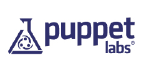
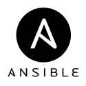

.. _12_cfg_mgt:

Configuration Management History & Basics
=========================================

Configuration Management
------------------------

What is it?

    *Configuration management is the process of standardizing resource
    configurations and enforcing their state across IT infrastructure in an
    automated yet agile manner.*

    -- `Puppet Labs`_

.. _Puppet Labs: http://puppetlabs.com/solutions/configuration-management

History of CM
-------------

- mid-1990s -- "snowflake system"; few systems
- Rise of Unix-like systems and commodity x86 hardware increased the need
- CFEngine -- First release 1993; v2 released in 2002
- mid-2000s through present

  - More agile CM systems emerged developed with the cloud in mind

- 2008

  - provisioning and management of individual systems were well-understood

Infrastructure as code
----------------------

- CM enables ops to define their infrastructure in *code*
- Install packages, configure software, start/stop services
- Ensure a state of a machine
- Ensure policies and standards are in place
- Provide history of changes for a system
- Repeatable way of rebuild a system
- Orchestrate a cluster of services together

Common Features for CM
----------------------

.. rst-class:: build

**Idempotent**
  Running the CM tool multiple times shouldn't change the state each time, only
  if a change is needed.

**System** *"facts"*
  Specific information about a machine which may include things like machine
  hardware, software installed, network information, etc

**Use of templates**
  Building dynamic config files by using templates and variables.

**Community code**
  Many CM platforms have user contributed "modules" that can be shared and used
  globally.

CM Platforms
------------

.. rst-class:: build

**CFengine**
  Lightweight agent system. Manages configuration of a large number of computers
  using the client–server paradigm or stand-alone. First released in 1993 by
  Mark Burgess and also the oldest CM Platform still widely used today.

**Puppet**
  Puppet consists of a custom declarative language to describe system
  configuration, distributed using the client–server paradigm. First released in
  2005 by Luke Kanies.

CM Platforms
------------

.. rst-class:: build

**Chef**
  Chef is a configuration management tool written in Ruby, and uses a pure Ruby
  DSL for writing configuration "recipes". A collection of recipes are called a
  cookbook. Also a client-server model. First released in 2009 by Adam Jacob.

**Ansible**
  Ansible is written in Python. Combines multi-node deployment, ad-hoc task
  execution, and configuration management in one package. Utilizes SSH with
  little to no remote agents. First released in 2012 by Michael DeHaan and
  purchased by Red Hat in 2015.

Puppet Example
--------------

- Install apache and start the service
- Puppet Domain Specific Language (DSL)

.. code-block:: puppet

  package { "apache":
    name    => "httpd",
    ensure  => present,
  }

  service { "apache":
    name    => "apache",
    ensure  => running,
    enable  => true,
    require => Package["apache"],
  }

Chef Example
------------

- Install apache and start the service
- Ruby code

.. code-block:: ruby

  package 'apache' do
    package_name 'httpd'
    action :install
  end

  service 'apache' do
    action [:enable, :start]
  end

Ansible Example
---------------

- Install apache and start the service
- Uses YAML file format for configuration

.. code-block:: yaml

  - hosts: all
    tasks:
      - name: 1. Install Apache
        yum: name=httpd state=present
      - name: 2. Start Apache Service
        service: name=httpd state=running enabled=yes

Push vs. Pull
-------------

.. rst-class:: build

**Pull**
  * Clients poll a centralized master periodically for updates (i.e. Chef,
    Puppet, Cfengine)
  * Pros: Full automation capabilities, increased scalability
  * Cons: configuration management specific DSL, difficult to send immediate
    changes

**Push**
  * Server calls client and can execute an immediate remote execution usually
    using ssh (i.e. Salt, Ansible)
  * Pros: Control, simplicity, can send commands immediately
  * Cons: Automation requires more work, Lack of scalability

Config Management Tool Comparisions
===================================

.. rst-class:: build

CFEngine
--------

Lightweight agent system. Manages configuration of a large number of computers
using the client–server paradigm or stand-alone. Any client state which is
different from the policy description is reverted to the desired state.
Configuration state is specified via a declarative language. CFEngine's
paradigm is convergent *"computer immunology"*.

**When to use it:**

Performance and low memory usage is the primary motivating factor for your
environment. If you also agree with the convergent and promise theory behind
CFEngine, its for you.

CFEngine: Pros
--------------

.. rst-class:: build

* Extremely fast
* Very low memory foot print
* Scales very well
* Has a lot of history and support for multiple platforms

CFEngine: Cons
--------------

.. rst-class:: build

* Doesn't fit as well with current DevOps culture
* Configuration format language is unique and difficult to understand
* Research based software project which can create interesting problems

.. rst-class:: build

Puppet
------

Puppet code design works as a list of dependencies, which can make your life
easier or more confusing, depending on the setup. Historically been the choice
for more sysadmins.

**When to use it:**

Puppet is a good choice if stability and maturity are key factors for you. It's
good for large enterprises with a heterogeneous environment and range of skills
on the DevOps team.

Puppet: Pros
------------

.. rst-class:: build

* Well-established support community
* It has the most mature interface and runs on nearly every OS
* Simple installation and initial setup
* Most complete Web UI in this space
* Strong reporting capabilities

Puppet: Cons
------------

.. rst-class:: build

* For more advanced tasks, you will need to use the CLI, which is Ruby-based
  (meaning you’ll have to understand Ruby)
* Support for pure-Ruby versions (rather than those using Puppet's customized
  DSL) is being scaled back
* Because of the DSL and a design that does not focus on simplicity, the
  Puppet code base can grow large, unwieldy, and hard to pick up for new people
  in your organization at higher scale
* Model-driven approach means less control compared to code-driven approaches

.. rst-class:: build

Chef
----

The Chef design is transparent and based on following the instructions it's
given, which means that you’ll have to make sure your instructions are clear.
Historically been the choice for developers.

**When to use it:**

If you already use Git and have a solid understanding of the Ruby language, it's
a great fit. Chef is good for development-focused teams and environments.  It's
good for enterprises looking for a more mature solution for a heterogeneous
environment.

Chef: Pros
----------

.. rst-class:: build

* Rich collection of modules and configuration recipes
* Code-driven approach gives you more control and flexibility over your
  configurations
* Being centered around Git gives it strong version control capabilities
* ‘Knife’ tool (which uses SSH for deploying agents from workstation) eases
  installation burdens

Chef: Cons
----------

.. rst-class:: build

* Learning curve is steep if you’re not already familiar with Ruby and
  procedural coding
* It's not a simple tool, which can lead to large code bases and complicated
  environments
* Doesn't support push functionality (yet)

Ansible
-------

.. rst-class:: build

* Ansible is tool used to deploy applications to remote nodes and provision
  servers in a repeatable way
* It gives you a common framework for pushing
  multi-tier applications and application artifacts using a push model setup
* Ansible is built on playbooks that you can apply to an extensive variety of
  systems for deploying your app.

Ansible: When to use it
-----------------------

.. rst-class:: build

* If getting up and running quickly and easily is important to you and you don't
  want to install agents on remote nodes or managed servers
* It's good if your need or focus is more on the system administrator side
* Ansible is focused on being streamlined and fast

Ansible: Pros
-------------

.. rst-class:: build

* SSH-based, so it doesn’t require installing any agents on remote nodes.
* Easy learning curve thanks to the use of YAML.
* Playbook structure is simple and clearly structured.
* Has a variable registration feature that enables tasks to register variables
  for later tasks
* Much more streamlined code base than some other tools

Ansible: Cons
-------------

.. rst-class:: build

* Less powerful than tools based in other programming languages.
* Does its logic through its DSL, which means checking in on the documentation
  frequently until you learn it
* Variable registration is required for even basic functionality, which can make
  easier tasks more complicated
* Introspection is poor. Difficult to see the values of variables within the
  playbooks
* No consistency between formats of input, output, and config files
* Struggles with performance speed at times.

Resources
---------

* `Takipi Blog on CM comparisions`__

**Readings**

* `Ansible Intro`__ -- Wed, Feb 10
* `Ansible Playbooks`__ -- Wed, Feb 10

.. __: http://blog.takipi.com/deployment-management-tools-chef-vs-puppet-vs-ansible-vs-saltstack-vs-fabric/
.. __: http://docs.ansible.com/ansible/intro.html
.. __: http://docs.ansible.com/ansible/playbooks.html
