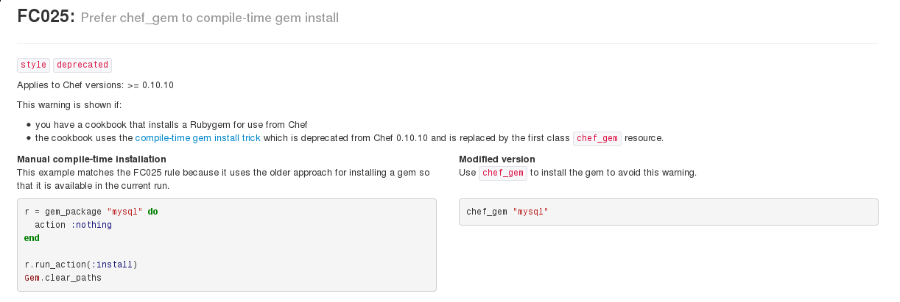

.. _13_chefdk_tk:

ChefDK and Test Kitchen Hands-on
================================

Summary for today
-----------------

* Install / use ChefDK
* Cover Foodcritic/Serverspec
* Deploy a test cookbook using Test Kitchen
* Do some basic linting fixes
* Add some simple features

ChefDK
------

* Chef Development Kit (`download`_/`docs`_)
* Contains all tools that are useful for Chef cookbook development
* Built as a single large rpm/deb file with all its dependencies embedded
* Contains:

  * Latest Chef (typically newer than stable)
  * Berkshelf
  * Test Kitchen
  * ChefSpec
  * Foodcritic

.. _download: https://downloads.chef.io/chef-dk/
.. _docs: https://docs.chef.io/#chef-dk-title

ChefDK
------

* Never install on a server, only on a workstation
* Installing gems for ChefDK:

::

  chef gem install kitchen-openstack

* If you're using RVM, you may run into issues
* Prefer you to run ChefDK locally, but we have an Openstack Image called
  ``chefdk`` available on the cluster for use.

Clone cs312-testcookbook
------------------------

Clone https://github.com/osuosl/cs312-testcookbook where ever your chefdk
environment is installed.

.. code-block:: bash

  $ yum install git
  $ git clone https://github.com/osuosl/cs312-testcookbook.git

Foodcritic
----------

* Lints cookbooks
* Not Perfect
* Rules follow ``/FC\d\d\d/`` where the leading digits are padded 0s

.. code-block:: bash

  $ cd cs312-testcookbook
  $ foodcritic .
  $ foodcritic -t FC007 . # Only look for FC007 violations

Foodcritic Oddities
-------------------

.. code-block:: ruby

  # This violates FC025
  r = gem_package("chef-rewind") do
    action :nothing
  end

  r.run_action(:install)
  Gem.clear_path

  # This does not violate FC025, but should
  gem_package("chef-rewind") do
    action :nothing
  end.run_action(:install)
  Gem.clear_path

Don't be afraid to clean up code that doesn't violate Foodcritic rules.
It is probably wrong anyway

Fixing Foodcritic Violations
----------------------------

http://acrmp.github.io/foodcritic/ has a great guide with examples and
descriptions for each and every rule.

Before Fix
----------

.. code-block:: bash

  $ foodcritic .
  FC025: Prefer chef_gem to compile-time gem install: ./recipes/default.rb:1

.. code-block:: ruby

  r = gem_package("chef-rewind") do
    action :nothing
  end

  r.run_action(:install)
  Gem.clear_path

After Fix
---------

.. code-block:: ruby

  chef_gem "chef-rewind"

Rubocop
-------

  *Role models are important.
  -- Officer Alex J. Murphy / RoboCop*

* https://github.com/bbatsov/rubocop
* Static Ruby code analyzer
* Enforces most of the best practices used in Ruby

Basic usage:

.. rst-class:: codeblock-sm

::

  $ rubocop recipes/default.rb
  Inspecting 1 file
  C

  Offenses:

  recipes/default.rb:21:1: C: %w-literals should be delimited by ( and )
  %w[ vim git curl wget bind-utils emacs ].each do |p|
  ^^^^^^^^^^^^^^^^^^^^^^^^^^^^^^^^^^^^^^^^

Configuring Rubocop
-------------------

Sometimes you want to ignore certain rules or files for specific reasons:

``.rubocop.yml``

.. code-block:: yaml

  AllCops:
    Include:
      - '**/Berksfile'
      - '**/Cheffile'
    Exclude:
      - 'metadata.rb'
  Lint/AmbiguousRegexpLiteral:
    Exclude:
      - 'test/integration/**/*.rb'

Test Kitchen
------------

*target*
    A target is a combination of driver, platform , and suite.

*driver*
    A driver tells test-kitchen how to spin up a VM.

*platform*
    A platform is the OS which the VM is running.

*suite*
    A suite is a chef ``run_list`` + a few other things

Targets
-------

* Named as ``suite-platform``

  - Each platform can only have one driver and provisioner
  - Each platform can have its own driver and provisioner configs
  - Other provisioner/driver configs are set as defaults

Example .kitchen.yml
--------------------

* Defaults to Vagrant+Virtualbox

.. rst-class:: codeblock-sm

.. code-block:: yaml

  ---
  provisioner:
  name: chef_solo

  platforms:
    - name: centos-6.6

  suites:
    - name: default
      run_list:
        - recipe[cs312-testcookbook::default]
    - name: wiki
      run_list:
        - recipe[cs312-testcookbook::wiki]
      driver_config:
        network:
          - ["forwarded_port", {guest: 8080, host: 8080}]
    - name: style
      run_list:
        - recipe[cs312-testcookbook::style]

Test Kitchen on Openstack
-------------------------

* Typically name this ``.kitchen.cloud.yml``

.. rst-class:: codeblock-sm

.. code-block:: yaml

  ---
  driver_config:
    openstack_username: <%= ENV['OS_USERNAME'] %>
    openstack_api_key: <%= ENV['OS_PASSWORD'] %>
    openstack_auth_url: <%= "#{ENV['OS_AUTH_URL']}/tokens" %>
    key_name: <%= ENV['OS_SSH_KEYPAIR'] %>
    private_key_path: <%= ENV['OS_PRIVATE_SSH_KEY'] %>
    public_key_path: <%= ENV['OS_PUBLIC_SSH_KEY'] %>
    openstack_tenant: <%= ENV['OS_TENANT_NAME'] %>
    floating_ip: <%= ENV['OS_FLOATING_IP'] %>
    floating_ip_pool: <%= ENV['OS_FLOATING_IP_POOL'] %>
    flavor_ref: <%= ENV['OS_FLAVOR_REF'] %>

  provisioner:
    name: chef_solo
    attributes:
      authorization:
        sudo:
          users:
            - centos
          passwordless: true

Test Kitchen on Openstack
-------------------------

*Continued...*

.. rst-class:: codeblock-sm

.. code-block:: yaml

  platforms:
  - name: centos-6.6
    driver_plugin: openstack
    driver_config:
      username: centos
      image_ref: "CentOS 6.6"

    suites:
      - name: default
        run_list:
          - recipe[osl-testcookbook::default]
      - name: wiki
        run_list:
          - recipe[osl-testcookbook::wiki]
      - name: style
        run_list:
          - recipe[osl-testcookbook::style]

Test Kitchen commands
---------------------

.. code-block:: bash

  $ kitchen list
  Instance           Driver   Provisioner  Last Action
  default-centos-66  Vagrant  ChefSolo     <Not Created>
  wiki-centos-66     Vagrant  ChefSolo     <Not Created>

  $ kitchen test default # Converge VM, run tests and destroy
  $ kitchen conv default # Converge VM (useful for development)
  $ kitchen verify default # Run tests but don't destroy
  $ kitchen login default # ssh into the VM

  # Run Openstack config
  $ KITCHEN_YAML=.kitchen.cloud.yml kitchen test default

  # Add this to your .bashrc as a useful alias
  alias tkc="KITCHEN_YAML=.kitchen.cloud.yml kitchen $@"

  # Run using your new alias (don't forget to source .bashrc!)
  $ tkc test default

Test Kitchen commands
---------------------

.. rst-class:: codeblock-sm

.. code-block:: bash

  $ kitchen
  Commands:
    kitchen console                         # Kitchen Console!
    kitchen converge [INSTANCE|REGEXP|all]  # Converge one or more instances
    kitchen create [INSTANCE|REGEXP|all]    # Create one or more instances
    kitchen destroy [INSTANCE|REGEXP|all]   # Destroy one or more instances
    kitchen diagnose [INSTANCE|REGEXP|all]  # Show computed diagnostic configuration
    kitchen driver                          # Driver subcommands
    kitchen driver create [NAME]            # Create a new Kitchen Driver gem project
    kitchen driver discover                 # Discover Test Kitchen drivers published on
                                            # RubyGems
    kitchen driver help [COMMAND]           # Describe subcommands or one specific
                                            # subcommand
    kitchen help [COMMAND]                  # Describe available commands or one specific
                                            # command
    kitchen init                            # Adds some configuration to your cookbook so
                                            # Kitchen can rock
    kitchen list [INSTANCE|REGEXP|all]      # Lists one or more instances
    kitchen login INSTANCE|REGEXP           # Log in to one instance
    kitchen setup [INSTANCE|REGEXP|all]     # Setup one or more instances
    kitchen test [INSTANCE|REGEXP|all]      # Test one or more instances
    kitchen verify [INSTANCE|REGEXP|all]    # Verify one or more instances
    kitchen version                         # Print Kitchen's version information

Openstack Env Variables
-----------------------

* Example: user: ``albertsl`` tenant: ``albertsl-cs312``
* Add this to your ``~/.bashrc`` file then run ``source ~/.bashrc``

.. rst-class:: codeblock-sm

.. code-block:: bash

  # OpenStack Variables
  export OS_USERNAME=albertsl
  export OS_PASSWORD=<your openstack password>
  export OS_TENANT_NAME=albertsl-cs312
  export OS_AUTH_URL=http://studentcloud.osuosl.org/5000/v2.0/
  export OS_PUBLIC_SSH_KEY=<openstack ssh public key full path location>
  export OS_PRIVATE_SSH_KEY=<openstack ssh private key full path location>
  # This should be called whatever you just imported
  export OS_SSH_KEYPAIR=<ssh keypair name>
  export OS_FLAVOR_REF=cs312

Serverspec
----------

`ServerSpec Resource Types`_

.. code-block:: ruby

  require 'serverspec'

  set :background, :exec

  %(vim-enhanced curl wget git bind-utils emacs).each do |p|
    describe package(p) do
      it { should be_installed }
    end
  end

  describe package('emacs') do
    it { should_not be_installed }
  end

.. _ServerSpec Resource Types: http://serverspec.org/resource_types.html

Tasks
-----

1. Create a branch ``$onid/cs312`` for your work
2. Fix the ``default`` recipe so it passes all the tests written for it
3. Write the missing tests for the ``wiki`` recipe
4. Fix all foodcritic issues
5. Fix all rubocop issues

Fix default recipe
------------------

1. nginx package, service
2. Existence of webroot and index.html
3. Everything in the ``http`` recipe that is included

Fix foodcritic issues
---------------------

1. Two in ``metadata.rb``
2. The rest in the ``style`` recipe

Fix rubocop issues
------------------

1. All files under recipes

