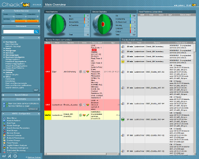
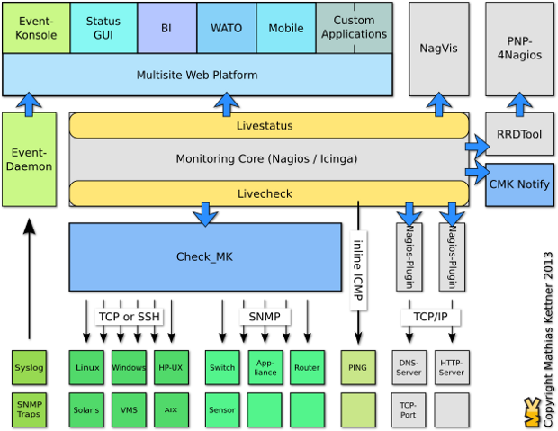

.. _16_nagios:

Monitoring: Nagios
==================

Monitoring Basics
-----------------

What types of resources should we monitor?

.. rst-class:: build

* Load
* Disk usage
* Memory/Swap usage
* Services: ssh, httpd, etc
* What else?

What is Nagios?
---------------

* Open source monitoring system
* Monitors Services

  * HTTP, SSH, ICMP, processor, load, etc

* Sends notifications of outages
* Offers a web interface

History of Nagios
-----------------

* Created in 1999 by Ethan Galstad
* Originally called "NetSaint" but was challenged for the trademark

  * Stands for *"Nagios Ain't Gonna Insist On Sainthood"*

* Icinga is a fork of Nagios created in 2009

  * Development process problems, lack of new features

* Nagios Plugins site

  * Community run site now called `Monitoring Plugins`_
  * Community collection of Nagios Plugins

.. _Monitoring Plugins: https://www.monitoring-plugins.org/

Components of Nagios
--------------------

.. rst-class:: build

**Core server process**
  * Core logic for monitoring
  * Keeps track of service states
  * Starts service checks
**CGI Web interface**
  * Simple web interface which connects to the core server process via sockets

Components of Nagios
--------------------

.. rst-class:: build

**Plugins**
  * Scripts written to gather monitoring information
  * Typically written in Perl, but can be written in about anything
  * Has an API that you follow to create your own plugin
**NRPE/NSCA**
  * Daemons that handle remote checks
  * NRPE: Active checking daemon
  * NSCA: Passive checking daemon (just listens for data)
    The client must:

    * Run the check (and schedule it)
    * Send the data to NSCA using ``send_nsca``

Passive vs. Active
------------------

.. image:: ../_static/nrpe.png
  :align: center
  :width: 90%

.. figure:: ../_static/nsca.png
  :align: center
  :width: 90%

  Images from nagios.org documentation site

Active: NRPE
------------

.. image:: ../_static/activechecks.png
  :align: right
  :width: 30%

* Active checks are:

  * Initiated by Nagios process
  * Run on a regularly scheduled basis

* Nagios server uses ``check_nrpe`` plugin to access remote host
* Remote host runs ``nrpe`` daemon
* Configuration is typically restricted to access only from nagios host
* Security implications should be considered

Problems with Active checks
---------------------------

What kind of problems would we have?

.. rst-class:: build

* If the host is unresponsive, all the checks go down at once
* How do you scale with thousands of hosts? (relies on a central server)
* Requires a service to be listening on the host (security concerns)

Passive: NSCA
-------------

.. image:: ../_static/passivechecks.png
  :align: right
  :width: 30%

* Passive checks are:

  * Initiated and performed by external applications/processes on remote server
  * Results are submitted to Nagios for processing

* NSCA daemon running on Nagios server listens for connections from passive
  hosts
* Remote host uses ``send_nsca`` which sends output to NSCA daemon running on
  Nagios server

When are Passive checks useful?
-------------------------------

* Asynchronous nature of a service that can't be checked via polling easily
* Located behind a firewall

CheckMK
-------

`Check_MK`_ is an extension to Nagios that allows more flexibility checking
servers.

* Uses a mixture of passive and active checks to offload work from the Nagios
  Core
* Offers Rule-based configuration and auto detection of servers
* Scales extremely well
* Excellent web frontend

.. _Check_MK: http://mathias-kettner.com/check_mk.html

CheckMK Architecture
--------------------

  Image from http://mathias-kettner.com/check_mk.html

Plugins
-------

.. rst-class:: codeblock-sm

.. code-block:: console

  # Install EPEL repo first!
  $ yum install nrpe nagios-plugins*
  $ cd /usr/lib64/nagios/plugins
  $ ./check_ssh localhost
  SSH OK - OpenSSH_6.6.1 (protocol 2.0) | time=0.188930s;;;0.000000;10.000000

  $ ./check_disk -w 15% -c 10%
  DISK OK - free space: / 8223 MB (85% inode=92%); /dev 235 MB (100% inode=99%);
  /dev/shm 244 MB (100% inode=99%); /run 240 MB (98% inode=99%); /sys/fs/cgroup
  244 MB (100% inode=99%); /run/user/1000 48 MB (100% inode=99%);|
  /=1376MB;8539;9041;0;10046 /dev=0MB;199;211;0;235 /dev/shm=0MB;207;219;0;244
  /run=4MB;207;219;0;244 /sys/fs/cgroup=0MB;207;219;0;244
  /run/user/1000=0MB;40;43;0;48

  $ ./check_http -H osuosl.org
  HTTP OK: HTTP/1.1 200 OK - 40668 bytes in 0.013 second response time
  | time=0.013421s;;;0.000000 size=40668B;;;0

NRPE Configuration
------------------

.. rst-class:: codeblock-sm

.. code-block:: console

  # /etc/nagios/nrpe.conf on the remote host
  command[check_users]=/usr/lib64/nagios/plugins/check_users -w 5 -c 10
  command[check_load]=/usr/lib64/nagios/plugins/check_load -w 15,10,5 -c 30,25,20
  command[check_hda1]=/usr/lib64/nagios/plugins/check_disk -w 20% -c 10% \
    -p /dev/hda1

  # Command ran on the nagios server
  check_nrpe -H remotehost.example.org -c check_load

  # Testing it on a local machine
  $ systemctl start nrpe
  $ /usr/lib64/nagios/plugins/check_nrpe -H 127.0.0.1 -c check_load
  OK - load average: 0.04, 0.13, 0.07|load1=0.040;15.000;30.000;0;
  load5=0.130;10.000;25.000;0; load15=0.070;5.000;20.000;0;

Nagios Configuration Overview
-----------------------------

.. figure:: ../_static/nagiosconfig.png
  :align: center
  :width: 65%

  Nagios configuration visualized

Nagios Config components
------------------------

.. rst-class:: build

**Main configuration file**
  * Configures how the daemon operates
**Resource file(s)**
  * User defined macros (i.e. notification commands)
**Object definition files**
  * Define ``hosts``, ``services``, ``hostgroups``, ``contacts``,
    ``contactgroups``, ``commands``
**CGI configuration file**
  * How the web interface is setup

Main configuration file
-----------------------

``/etc/nagios/nagios.cfg``

`Main configuration file options`__

.. __: https://assets.nagios.com/downloads/nagioscore/docs/nagioscore/4/en/configmain.html

.. code-block:: ini

  log_file=/var/log/nagios/nagios.log
  cfg_file=/etc/nagios/objects/commands.cfg
  cfg_file=/etc/nagios/objects/contacts.cfg
  cfg_file=/etc/nagios/objects/timeperiods.cfg
  cfg_file=/etc/nagios/objects/templates.cfg
  cfg_file=/etc/nagios/objects/localhost.cfg
  cfg_dir=/etc/nagios/conf.d
  status_update_interval=10

Resource configuration file(s)
------------------------------

``/etc/nagios/private/resource.cfg``

* Define ``$USERx$`` `macros`__ which can be used in command definitions
* Useful for storing sensitive information such as usernames/passwords
* Also useful for storing frequently used paths
* Support up to 32 macros (``$USER1$`` through ``$USER32$``)

.. __: https://assets.nagios.com/downloads/nagioscore/docs/nagioscore/4/en/macros.html

.. code-block:: ini

  # Sets $USER1$ to be the path to the plugins
  $USER1$=/usr/lib64/nagios/plugins
  # Sets $USER2$ to be the path to event handlers
  #$USER2$=/usr/lib64/nagios/plugins/eventhandlers
  # Store some usernames and passwords (hidden from the CGIs)
  #$USER3$=someuser
  #$USER4$=somepassword

Object Configuration Overview
-----------------------------

``/etc/nagios/objects``

* Objects in Nagios are elements that are involved in the monitoring and
  notification logic
* Types of objects include:

  * Services, Service Groups, Hosts, Host Groups, Contacts, Contact Groups,
    Commands, Time Periods, Notification Escalations, Notification and Execution
    Dependencies

* Objects are defined using a flexible template format
* `Object Configuration Overview Docs`__

.. __: https://assets.nagios.com/downloads/nagioscore/docs/nagioscore/4/en/configobject.html

Objects Defined
---------------

.. rst-class:: build

**Hosts**
  Central object in monitoring logic and are usually physical devices, have an
  IP address, have one more services assigned to it and can have a parent/child
  relationship with other hosts configured.
**Host Groups**
  Groups of one or more hosts. Groups can make it easier to view the status of
  related hosts from the web interface and simplify the configuration.
**Services**
  Another central object in monitoring logic and are associated with hosts. They
  can be attributes of a host (CPU load, disk usage, etc.), services provided by
  the host (HTTP, SSH, etc.), and other things associated with the host (DNS
  records, etc.)

Objects Defined
---------------

.. rst-class:: build

**Service Groups**
  Groups of one ore more services. Service groups can make it easier to view
  status of related services in the web interface and simplify the
  configuration.
**Contacts**
  People involved in the notification process. Contacts have one or more
  notification methods (cell phone, pager, email, etc.), and receive
  notifications for hosts and services they are responsible for.
**Contact Groups**
  Groups of one or more contacts.  Contact groups can make it easier to define
  all the people who get notified when certain host or service problems occur.

Objects Defined
---------------

.. rst-class:: build

**Time Periods**
  Used to control when hosts and services can be monitored and when contacts can
  receive notifications.
**Commands**
  Used to tell Nagios what programs, scripts, etc. it should execute to perform
  its tasks. Tasks may include host and service checks, notifications, event
  handlers and much more.

Object Definition Examples
--------------------------

.. code-block:: console

  # Host definition
  define host {
    host_name      foo
    alias          foo.example.org
    address        10.0.0.100
    use            generic-host
    hostgroups     nrpe-hosts,ping-hosts
    contact_groups admins
  }

  # Host Group definition
  define hostgroup {
    hostgroup_name  example-servers
    alias           Example Servers
    members         foo,bar
  }

  # Service definition
  define service {
    use                 generic-service
    hostgroup_name      nrpe-hosts
    service_description SSH
    check_command       check_ssh
  }

  # Contact definition
  define contact {
    contact_name  nagiosadmin
    use           generic-contact
    alias         Nagios Admin
    email         nagios@example.org
  }

  # Contact group definition
  define contactgroup {
    contactgroup_name admins
    alias             Nagios Admins
    members           nagiosadmin
  }

  # 'workhours' Time Period definition
  define timeperiod {
    timeperiod_name workhours
    alias           Normal Work Hours
    monday          09:00-17:00
    tuesday         09:00-17:00
    wednesday       09:00-17:00
    thursday        09:00-17:00
    friday          09:00-17:00
  }

  # Command definition
  define command {
    command_name    check_ping
    command_line    $USER1$/check_ping -H $HOSTADDRESS$ -w \
      $ARG1$ -c $ARG2$ -p 5
  }

CGI Configuration File
----------------------

``/etc/nagios/cgi.cfg``

* Uses HTAuth (Simple authentication)
* Users need to be added to the ``authorized_for_*`` options

.. code-block:: ini

  main_config_file=/etc/nagios/nagios.cfg
  physical_html_path=/usr/share/nagios/html
  url_html_path=/nagios
  use_authentication=1
  authorized_for_system_information=nagiosadmin
  authorized_for_configuration_information=nagiosadmin
  authorized_for_system_commands=nagiosadmin
  authorized_for_all_services=nagiosadmin
  authorized_for_all_hosts=nagiosadmin
  authorized_for_all_service_commands=nagiosadmin
  authorized_for_all_host_commands=nagiosadmin

Installing Nagios
-----------------

.. code-block:: console

  $ yum install epel-release
  $ yum install nagios
  $ systemctl start nagios httpd

* Log into http://140.211.168.XXX/nagios
* user: ``nagiosadmin`` password: ``nagiosadmin``

Resources
---------

* `Nagios Core Documentation`__
* `CGI Configuration File Options`__
* `Authentication And Authorization In The CGIs`__

.. __: http://nagios.sourceforge.net/docs/nagioscore/4/en/toc.html
.. __: https://assets.nagios.com/downloads/nagioscore/docs/nagioscore/4/en/configcgi.html
.. __: https://assets.nagios.com/downloads/nagioscore/docs/nagioscore/4/en/cgiauth.html
