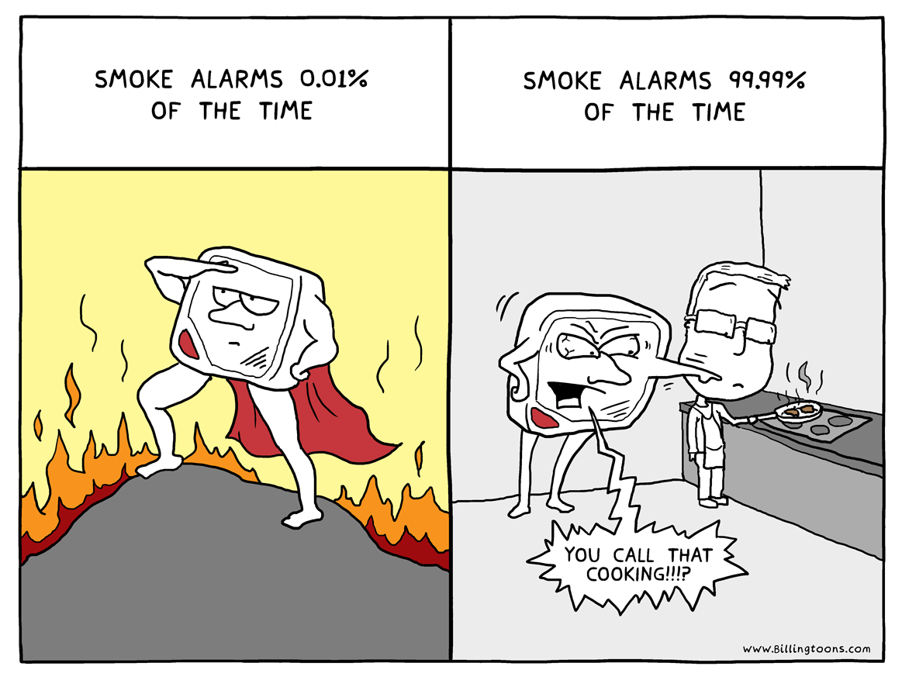

.. _17_monitoring:

Monitoring Concepts
===================

Definitions
-----------

* Specificity
* Sensitivity
* Expected Value

Specificity
-----------

* Complement to the False-Negative Rate
* Measures true negatives against identified negatives
* Often called the True-Negative Rate

Sensitivity
-----------

* Complement to the False-Positive Rate
* Measures true positives against identified positives
* Often called the True-Positive Rate

Car Alarms
----------

* Car alarms have a low sensitivity rate (They don't go off when they should)
* They also have a low specificity rate (They go off when they shouldn't)

**Nobody** likes car alarms.

Smoke Alarms
------------

Smoke Alarms
------------

* Smoke alarms go off frequently (low Sensitivity)
* Smoke alarms almost always go off when there is smoke (high Specificity)

Despite the fact that Smoke Alarms don't score great, we're okay with this.

**Why?**

Example
-------

Suppose you have a server you know gets a lot of network connections.

Thinking ahead, you bumped **nf_conntrack_max**, and have a nagios check
that determines if you can open a new connection.

Additionally, you have monitoring that graphs
``ss -4 -a | tail -n +2 | wc -l`` so
you know the number of connections over time.

Example
-------

One day you wake up to an alert that says ``ip_conntrack: table
full, dropping packet error``. You quickly check your graph of connections
and observe.. that the connections are significantly lower than the max.

What you know

* How many connections to your various network devices, via ``netstat``, say
  **63**
* Your table is full, and packets are being dropped
* Your max is greater than the number of connections you see, the max is
  currently **65535**

Example
-------

It turns out that your monitoring via ``ss`` was incorrect

``ss`` doesn't list all connections! It doesn't list NAT or
routed connections at all. Instead, lets look at the routing table
in ``/proc``!

.. code-block:: bash

    $ cat /proc/net/nf_conntrack_max
    65535
    $ wc -l /proc/net/nf_conntrack
    65535
    $ ss -4 -a | tail -n +2 | wc -l
    75

Example
-------

* This test has a bad specificity (there are false-negatives)
* But its sensitivity is okay (low false-positives)
* How bad is this test?

Tests
-----

Possibilities:

1. low sensitivity and low specificity
2. low sensitivity, high specificity
3. high sensitivity, low specificity
4. high sensitivity, high specificity

Is 2 or 3 worse?

Example
-------

How does this matter?

* Even when you can monitor problems, you can't monitor always
  monitor all causal events, both due to realism and human error
* When your monitoring fails to alert, or even measure an event,
  you need to be monitoring a causal event. A better alert in this case
  could include:

  - Measuring number of connections from the raw table
  - Alerting when that number goes over a threshold

Lessons
-------

* Measuring causes is better than correlations
* Measuring correlations is better than nothing
* Low specificity alarms are bad, highly sensitive alarms are worse

Time Series Data
----------------

Collecting time series data can be very interesting. A time series
is **a sequence of data measured over a period of time**.

Some time series data software attempts to integrate monitoring,
but a lot of them are better used alongside monitoring solutions
like Nagios.

Time Series Data is often collected using tools based on `RRD`_

.. _RRD: http://en.wikipedia.org/wiki/RRDtool

Why Time Series Data is Important
---------------------------------

* Collects history of data (Nagios doesn't!)
* Allows for data analysis
* Can be used to correlate events
* Performance monitoring and long-term performance gains
* Discovering trends in data

Kinds of Analysis
-----------------

* mean, median, mode
* Holt-Winters (triple exp. smoothing)
* anomaly detection (often using ESD)

What is Analysis Used For
-------------------------

* Monitoring
* Orchestration
* Correlation of events

Learning More
-------------

* `Graphite`_
* `InfluxDB`_
* `OpenTSDB`_
* `kairosDB`_
* `Practical Anomaly Detection`_
* `Time Series Aggregator`_
* `Seasonal or Periodic Time Series`_

.. _Graphite: http://graphite.wikidot.com/
.. _InfluxDB: http://influxdb.com/
.. _OpenTSDB: http://opentsdb.net/
.. _kairosDB: https://github.com/kairosdb/kairosdb
.. _Practical Anomaly Detection: https://blog.twitter.com/2015/introducing-practical-and-robust-anomaly-detection-in-a-time-series
.. _Time Series Aggregator: https://blog.twitter.com/2014/tsar-a-timeseries-aggregator
.. _Seasonal or Periodic Time Series: http://www.r-bloggers.com/seasonal-or-periodic-time-series/
