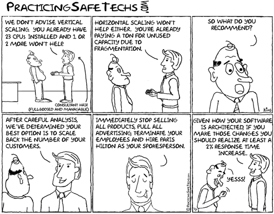
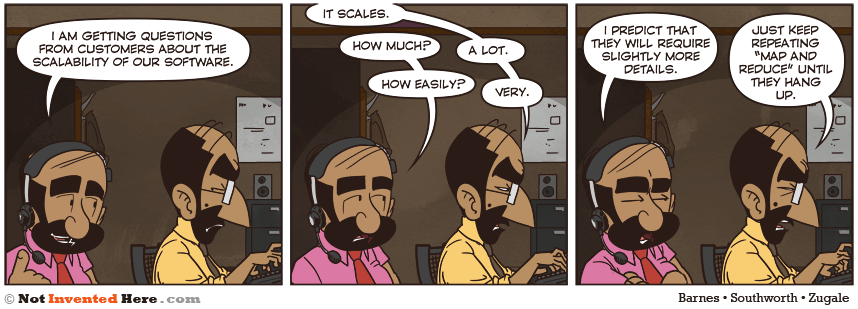

.. _18_high_availability:

High Availability & Scaling
===========================

High Availability Defined
-------------------------

  *A characteristic of a system, which aims to ensure an agreed level of
  operational performance for a higher than normal period.* -- Wikipedia

Three principles of HA:

.. rst-class:: build

#. Elimination of single points of failure
#. Reliable crossover
#. Detection of failures as they occur

.. note::

  * This means adding redundancy to the system so that failure of a component does
    not mean failure of the entire system.
  * In multi-threaded systems, the crossover point itself tends to become a single
    point of failure. High availability engineering must provide for reliable
    crossover.
  * If the two principles above are observed, then a user may never see a failure.
    But the maintenance activity must.

HA Terminology
--------------

* Availability
* Redundancy
* Reliability
* Single point of failure (SPOF)
* Fault Tolerance

What is Availability?
---------------------

Probability that a system is operational at a given time generally given in
percentage.

.. math::
  \frac { (\text{Time resource was available} - \text{Time resource was
  unavailable}) } { \text{Total Time} }

.. rst-class:: build

**Ideal is typically five 9s**, ``99.999%``
  This gives less than fifty three minutes of downtime per year
**A reasonably good goal is** ``99.9%``
  This allows for 100x more downtime than five 9s.

Measuring uptime/downtime is **hard**

Reasons for Un-Availability
---------------------------

.. rst-class:: build

* Physical hardware
* Network infrastructure
* Operating system
* Application
* Sysadmin intervention
* Physical location
* Redundancy cross-over

Downtime Measuring Example
--------------------------

Consider the following scenario:

.. rst-class:: build

* You run an OpenStack cluster. One day, your authentication API goes down.
* None of your customers can log in or interact with any of the other APIs.
* All of the customers existing services continue running (VMs stay up, etc).
* What is the downtime?

Redundancy
----------

  *Redundancy is the duplication of critical components or functions of a
  system with the intention of increasing reliability of the system.* --
  Wikipedia

*Redundancy is closely tied to reliability (more redundant systems usually have
higher reliability).*

.. rst-class:: build

**Passive Redundancy**
  Used to achieve high availability by including enough excess capacity in the
  design to accommodate a performance decline.
**Active Redundancy**
  Used in complex systems to achieve high availability with no performance
  decline.

Reliability
-----------

  *Reliability can be defined as the probability that a system will produce
  correct outputs up to some given time.* -- Wikipedia

Single Point of Failure
-----------------------

Traditionally a point with 0 redundancy, often instead means the point
in the system with the lowest redundancy value.

Examples:

.. rst-class:: build

* Single load balancer with multiple web nodes
* Single database node
* Network switch
* Non-redundant power

Single Point of Failure
-----------------------

Identifying SPOFs is a hard task.

Many places will do fire drills, where a system in staging/pre-production is
purposefully taken down so that failure scenarios can be observed, and single
points of failure can be identified and fixed.

You can read more about Netflix does this wth `Chaos Monkey`__.

.. __: http://techblog.netflix.com/2012/07/chaos-monkey-released-into-wild.html

Fault Tolerance
---------------

Fault tolerance is the property that enables a **system** to continue operating
in the event of a fault happening.

* Redundancy is a part of the Fault Tolerance
* Redundancy generally refers to a component while Fault tolerance refers to a
  system-wide ability to deal with faults

Example:

* RAID is Fault Tolerant
* The hard drives are redundant

Examples of HA Systems
----------------------

Scaling
=======

Scaling
-------

You can define scaling as adding more resources to increase performance,
reliability, or redundancy.

Two forms:

.. rst-class:: build

* Horizontal
* Vertical

Horizontal Scaling
------------------

Adding more nodes to a system.

Also known as scaling out.

Examples:

.. rst-class:: build

* Adding another web node
* Adding a second (or third, etc) database node

Horizontal Scaling
------------------

.. rst-class:: build

**Pros:**
  * Typically has higher upper bound than vertical scaling
  * Can bring greater increases than vertical scaling
  * Redundancy

**Cons:**
  * Expensive
  * Maybe not as much redundancy as you expect
  * Brings more complexity to manage
  * Unused capacity problems (pick: cost or even more complexity)

Horizontal Scaling Complexity
-----------------------------

Horizontal scaling increases complexity because:

* Requires load balancing, replication, etc
* Budgeting for peak load + X% can leave a lot of unused capacity
* Managing lots of nodes is harder than managing fewer nodes

Vertical Scaling
----------------

Adding more resources to a particular node(s)

Also known as scaling up.

Examples:

.. rst-class:: build

* Adding a faster CPU
* Adding more RAM
* Adding faster/larger disks

Vertical Scaling
----------------

.. rst-class:: build

**Pros:**
  * Easier than horizontal scaling
  * No added complexity
  * Usually cheaper

**Cons:**
  * No redundancy (but maybe more reliable)
  * Has a lower upper bound
  * Diminishing returns

Scaling
-------

Virtual IP
----------

* Doesn't correspond to a particular physical nic
* Shared between many nics across different machines (and one nic can have
  multiple addrs)
* Can be moved across any other ip on the same subnet
* Variety of implementations: ``keepalived``, ``carp`` and ``ucarp``

Virtual IP
----------

Limitations:

  * Doesn't handle the replication of data
  * Can't move across subnets
  * Really only good for making an IP address(es) redundant
  * Sometimes ARP can bite you when moving the IP's around

Scalability
-----------

  *A desirable property of a system which indicates its ability to either handle
  growing amounts of work in a graceful manner, or to be readily enlarged as
  demands increase.*

Truths about Scalability
------------------------

#. It won't scale if it's not designed to scale
#. Even if its designed to scale, there's going to be pain

CAP Theorem
-----------

States that it is impossible for a distributed computer system to simultaneously
provide all three of the following guarantees:

.. rst-class:: build

* **Consistency:** All nodes see the same data at the same time
* **Availability:** A guarantee that every request receives a response about
  whether it succeeded or failed
* **Partition Tolerance:** the system continues to operate despite arbitrary
  partitioning due to network failures

**PICK TWO**

CAP Theorem
-----------

.. image:: ../_static/cap.svg

7 Stages of Scaling Web Applications
------------------------------------

#. The Beginning
#. More of the same, just bigger
#. The **Pain** Begins
#. The Pain Intensifies
#. This Really Hurts!
#. Getting (a little) less painful
#. Entering the unknown..

Stage 1 -- The Beginning
------------------------

.. rst-class:: build

* Simple Architecture

  * Load balancers
  * Pair of web servers
  * Database Server
  * Internal Storage

* Low complexity and overhead means quick development and lots of features, fast
* No redundancy, low operational cost -- great for startups

Stage 2 -- More of the same, just bigger
----------------------------------------

.. rst-class:: build

* Business is becoming successful -- risk tolerance low
* Add redundant load balancers
* Add more web servers for performance
* Scale up the database and optimize
* Add database redundancy
* Still relatively simple from an application perspective

Stage 3 -- The Pain Begins
--------------------------

.. rst-class:: build

* Publicity hits (Reddit, Hacker News, etc)
* Setup reverse caching proxies (Varnish) -- to cache static content
* Add even more web servers (Managing content becomes painful)
* Single database can't cut it anymore

  * Split reads and writes
  * All writes go to a single master server with read-only slaves

* May require some re-coding of the application

Stage 4 -- The Pain Intensifies
-------------------------------

.. rst-class:: build

* Caching with memcached
* Replication doesn't work for everything

  * Single "writes" database
  * Too many writes
  * Replication takes too long

* Database partitioning starts to make sense

  * Certain features get their own database

* Shared storage makes sense for content
* Requires significant re-architecting of the application and data base

Stage 5 -- This Really Hurts!
-----------------------------

.. rst-class:: build

* Panics sets in. *Hasn't anyone done this before?*

  * Re-thinking entire application / business model
  * Why didn't we architect this thing for scale?

* Can't just partition on features -- what else can we use?

  * Partitioning based on geography, last name, user ID, etc
  * Create user-clusters

* All features available on each user-cluster
* Use a hashing scheme or master DB for locating which user belongs to which
  cluster

Stage 6 -- Getting (a little) less painful
------------------------------------------

.. rst-class:: build

* Scalable application and database architecture
* Acceptable performance
* Starting to add new features again
* Optimizing some of the code
* Still growing, but it's managable

Stage 7 -- Entering the unknown...
----------------------------------

**Where are the remaining bottlenecks?**

.. rst-class:: build

* Power, Space
* Bandwidth, CDN, Hosting provider big enough?
* Load balancer bottlenecks
* Storage
* People and process
* Database technology limits -- scalable, key-value store anyone?

Stage 7 -- Entering the unknown...
----------------------------------

**All eggs in one basket?**

.. rst-class:: build

* Single datacenter
* Single instance of the data
* Difficult to replicate data and load balance geographically

Good or Best Practices
----------------------

.. rst-class:: build

* Don't re-invent the wheel, copy someone else
* Think simplicity
* Think horizontal, not vertical, on everything
* Use commodity equipment
* Make troubleshooting easy
* Don't spend your time over-optimizing
* Test your ability to scale with appropriate load testing
* Use caching wherever it makes sense
* Lots of memory and 64-bit architecture helps
* Evaluate every feature vs. performance / scalability impact

Resources
---------

* `7 Stages of Scaling Web Applications`__

.. __: http://www.slideshare.net/davemitz/7-stages-of-scaling-web-applications/15-Pain_Scale_Back
