.. _21_virtualization:

Virtualization
==============

History, KVM and Openstack

IaaS/PaaS/SaaS, Ganeti, Cloud Images and Packer

History of Virtualization
-------------------------

.. figure:: ../_static/virtualization-history.png
  :width: 100%
  :align: center

  Adam Jollans - IBM - SCALE 13x

Hypervisors
-----------

  *Software, firmware or hardware that creates and runs virtual machines.*

.. rst-class:: build

* A computer that runs virtual machines are called *host machines*
* Each virtual machine is typically called a *guest machine*
* Hypervisor presents the guest machine with a virtual operating platform that
  resembles a real machine

Types of Hypervisors
--------------------

.. rst-class:: build

**Type 1 - native or bare-metal hypervisor**
  * Hypervisors that directly run and control the hardware on the host system and
    manage the guest systems
  * Examples include: Xen, VMWare ESX Server and Microsoft Hyper-V

**Type 2 - hosted hypervisor**
  * Hypervisors run on a conventional operating system and abstract guest
    operating systems from the host operating system
  * Examples include: VMWare Workstation and VirtualBox

.. rst-class:: build

*Which hypervisor type does KVM fall under?*

Virtualization Framework Generalized
------------------------------------

.. figure:: ../_static/virt-framework.png
  :width: 100%
  :align: center

  Adam Jollans - IBM - SCALE 13x

Virtualization Framework - KVM
------------------------------

.. figure:: ../_static/virt-kvm.png
  :width: 100%
  :align: center

  Adam Jollans - IBM - SCALE 13x

KVM
---

Open Source hypervisor based on Linux

.. rst-class:: build

**KVM**
  * Kernel-Based Virtual Machine
  * Kernel module that turns Linux into a virtual machine monitor
  * Requires hardware CPU support
  * Merged into mainline Linux

**QEMU**
  * Emulator used for I/O device virtualization
  * Runs as a user-space process
  * Avi Kivity began the development of KVM at Qumranet in the mid-2000s

Processors Supported
--------------------

* x86 with virtualization extensions

  * Intel VT-x
  * AMD (AMD-V)

* ARM64
* POWER8
* IBM z Systems

http://www.linux-kvm.org/page/Processor_support

KVM Visualized
--------------

.. figure:: ../_static/kvm-layers.png
  :width: 80%
  :align: center

  Adam Jollans - IBM - SCALE 13x

KVM Command Line
----------------

KVM has **a lot** of options

.. code-block:: console

  # Create a virtual disk file
  $ qemu-img create -f qcow2 disk.img 10g

  # Start a VM up and boot to an ISO
  $ qemu-system-x86_64 -hda disk.img -cdrom \
    /path/to/CentOS-6.6-x86_64-minimal.iso -boot d -m 1024m

KVM on OpenStack
----------------

.. rst-class:: codeblock-sm

.. code-block:: console

  /usr/libexec/qemu-kvm -name instance-00000baa -S -M rhel6.6.0 -cpu
  Westmere,+rdtscp,+pdpe1gb,+dca,+pcid,+pdcm,+xtpr,+tm2,+est,+smx,+vmx,+ds_cpl,+monitor,+dtes64,+pclmuldq,+pbe,+tm,+ht,+ss,+acpi,+ds,+vme
  -enable-kvm -m 512 -realtime mlock=off -smp 1,sockets=1,cores=1,threads=1 -uuid
  96bea55c-6d58-4dcf-bc52-09aed81c0cee -smbios type=1,manufacturer=RDO
  Project,product=OpenStack
  Nova,version=2014.1.3-3.el6,serial=44454c4c-3400-1051-8059-c7c04f534b31,uuid=96bea55c-6d58-4dcf-bc52-09aed81c0cee
  -nodefconfig -nodefaults -chardev
  socket,id=charmonitor,path=/var/lib/libvirt/qemu/instance-00000baa.monitor,server,nowait
  -mon chardev=charmonitor,id=monitor,mode=control -rtc base=utc,driftfix=slew
  -no-kvm-pit-reinjection -no-shutdown -device
  piix3-usb-uhci,id=usb,bus=pci.0,addr=0x1.0x2 -drive
  file=/var/lib/nova/instances/96bea55c-6d58-4dcf-bc52-09aed81c0cee/disk,if=none,id=drive-virtio-disk0,format=qcow2,cache=none
  -device
  virtio-blk-pci,scsi=off,bus=pci.0,addr=0x4,drive=drive-virtio-disk0,id=virtio-disk0,bootindex=1
  -drive
  file=/var/lib/nova/instances/96bea55c-6d58-4dcf-bc52-09aed81c0cee/disk.swap,if=none,id=drive-virtio-disk1,format=qcow2,cache=none
  -device
  virtio-blk-pci,scsi=off,bus=pci.0,addr=0x5,drive=drive-virtio-disk1,id=virtio-disk1
  -netdev tap,fd=35,id=hostnet0,vhost=on,vhostfd=39 -device
  virtio-net-pci,netdev=hostnet0,id=net0,mac=fa:16:3e:35:5f:f4,bus=pci.0,addr=0x3
  -chardev
  file,id=charserial0,path=/var/lib/nova/instances/96bea55c-6d58-4dcf-bc52-09aed81c0cee/console.log
  -device isa-serial,chardev=charserial0,id=serial0 -chardev pty,id=charserial1
  -device isa-serial,chardev=charserial1,id=serial1 -device usb-tablet,id=input0
  -vnc 10.1.0.114:11 -k en-us -vga cirrus -device
  virtio-balloon-pci,id=balloon0,bus=pci.0,addr=0x6 -msg timestamp=on

Xen
---

Micro-kernel hypervisor for Linux or BSD

.. rst-class:: build

* Originated as a research project at the University of Cambridge
* Publicly released in 2003 under the GPLv2
* Currently supports IA-32, x86-64 and ARM CPUs
* Amazon, Linode, Softlayer and Rackspace all use Xen
* Purchased by Citrix Systems in 2007
* Moved under the Linux Foundation in 2013
* Supports virtual machine live migration

Xen Hypervisor Architecture
---------------------------

Xen Project runs in a more privileged CPU state than any other software on the
machine.

**Domains**
  * Dom0 -- Domain that has privileged access to hardware, or node node
  * DomU -- Unprivileged domains (VMs), or guests

Types of Xen virtualization
---------------------------

**Paravirtualization (PV)**
  * Simulates real hardware (PV Guests)
  * Guests are run in a modified OS and use a special hypercall ABI
**Hardware Virtual Machine (HVM)**
  * Uses hardware assisted virtualization via the CPU
  * HVM guests with PV drivers (PV-on-HVM or PVH) provide better performance
    than pure PV

Xen Visualized
---------------

.. figure:: ../_static/xen.png
  :width: 100%
  :align: center

KVM vs. Xen
-----------

.. csv-table::
  :header: KVM, Xen

  Less mature, More mature
  Runs like a normal unix app, Blackbox feel for how it works
  Always been in mainline, Had trouble getting into mainline Linux
  Requires CPU support, Doesn't require CPU support
  Development is very active and growing, Development has slowed a bit
  "Used by newer cloud providers (i.e. GCE, DigitalOcean)", "Used by Amazon EC2"

Libvirt -- KVM management
-------------------------

Libvirt is an open source API daemon that standardizes management of various
virtualization platforms.

.. figure:: ../_static/libvirt.png
  :width: 60%
  :align: center

  Adam Jollans - IBM - SCALE 13x

Libvirt Features
----------------

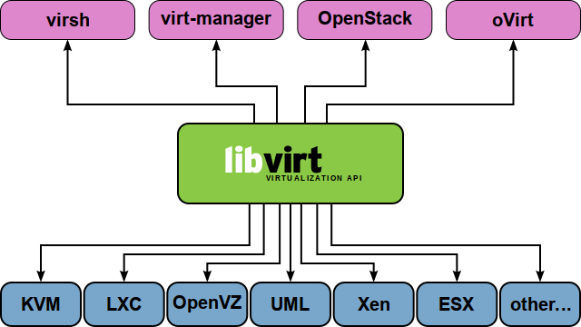

* Manages multiple hypervisors (KVM, Xen, VMware ESX, QEMU, etc)
* Powerful CLI tool, but can be complex to use
* Provides a network daemon to provide API access and remote access
* Development backed by Red Hat
* Base tool for other management tools:

  * OpenStack, oVirt, virt-manager, Kimchi to just name a few...

<Name> as a Service
-------------------

.. figure:: ../_static/cloud-computing-layers.png
  :align: right

  `Wikipedia`__

.. __: https://en.wikipedia.org/wiki/Cloud_computing#Infrastructure_as_a_service_.28IaaS.29

.. rst-class:: build

**SaaS**
  Software as a Service
**Paas**
  Platform as a Service
**IaaS**
  Infrastructure as a Service

Infrastructure as a Service
---------------------------

  *Virtual computing platform that typically includes automated methods for
  deploying virtual machines on a set of physical machines*

Examples:

.. rst-class:: build

* EC2
* OpenStack
* oVirt
* Ganeti
* XenServer, VMWare ESX/ESXi
* Apache CloudStack, OpenNebula
* Microsoft Hyper-V

Platform as a Service
---------------------

  *A platform that provides customers the ability to develop, run and manage web
  applications without the complexity of building and maintaining the underlying
  infrastructure*

Typically layered on top of IaaS

Examples:

.. rst-class:: build

* AWS
* CloudFoundry, OpenShift
* Salesforce
* Google App Engine
* Engine Yard, Heroku

Software as a Service
---------------------

  *Software delivery model in which software is provided on a subscription basis
  and centrally hosted. Also referred to as "on-demand software".*

* Typically layered on top of PaaS and/or IaaS
* Software is generally designed to be multi-tenant
* Updated by a central provider for all customers
* Provider deals with scaling up the application for customers

Examples:

* Google Docs, Twitter, Facebook, Flickr, etc

IaaS Platforms
--------------

.. rst-class:: build

**Private Cloud**
  * OpenStack
  * Ganeti
  * oVirt
  * Apache CloudStack

**Public Cloud**
  * Amazon EC2
  * Linode
  * DigitalOcean
  * Rackspace

OpenStack
---------

Open source cloud computing platform

* Started in 2010 as a joint venture with NASA and Rackspace
* Has a modular architecture
* Very complicated, but has the potential to scale very well
* Development ongoing, API's/Architecture changes on each release
* Open Development, Design and Community governance
* Combines compute, storage and network into one suite
* Multi-site

OpenStack Visualized
--------------------

.. figure:: ../_static/openstack.png
  :width: 100%
  :align: center

  Adam Jollans - IBM - SCALE 13x

Provision a VM on OpenStack
----------------------------

.. figure:: ../_static/openstack-provision.png
  :width: 100%
  :align: center

  Adam Jollans - IBM - SCALE 13x

Ganeti
------

**Key Features:**
  * High-availability built-in
  * Relatively simple architecture compared to other platforms
  * Easy to expand and manage
  * No cloud-like features by default -- good for "pet" VMs
  * Designed to deal with hardware failures
  * Does not use libvirt (was created before libvirt existed)
  * Primary CLI driven
  * Easy to customize

Ganeti Cluster
--------------

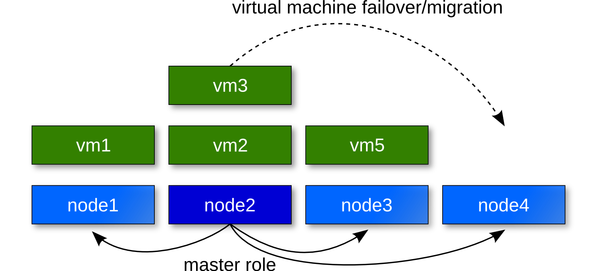

Ganeti Architecture
-------------------

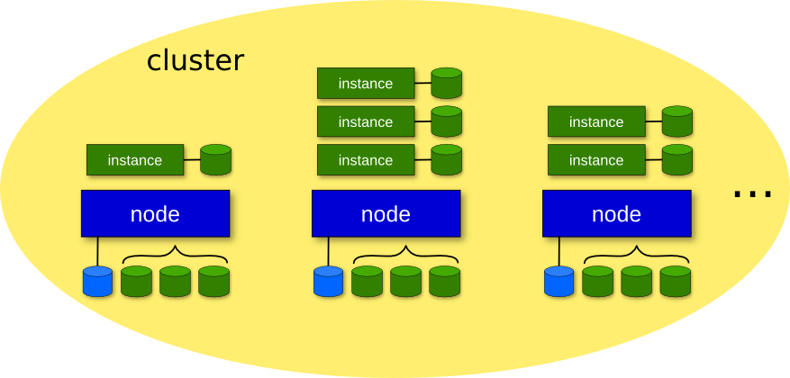

Ganeti Components
-----------------

* Python
* Haskell
* DRBD
* LVM
* Hypervisor (KVM or Xen)

Distributed Replicated Block Device (DRBD)
------------------------------------------

**Distributed replicated storage system (think RAID1 over the network)**

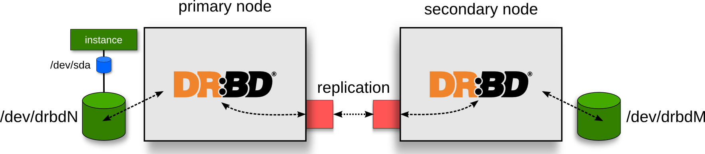

KVM Live Migration
------------------

**A feature that allows a virtual machine to move from one host to another host
while staying online.**

* Depends on having a block device that is replicated on both nodes
* Transfers active memory
* Pauses VM
* Transfers state of vm to new host
* Continue VM

KVM Live Migration
------------------

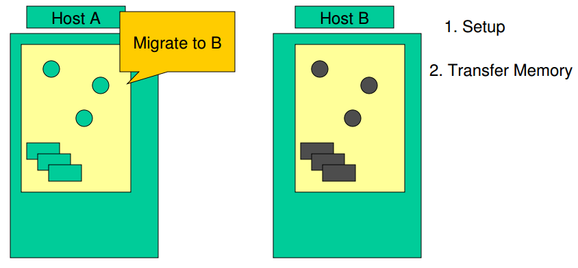

  `KVM Forum 2007`__

.. __: http://www.linux-kvm.org/wiki/images/5/5a/KvmForum2007$Kvm_Live_Migration_Forum_2007.pdf

KVM Live Migration
------------------

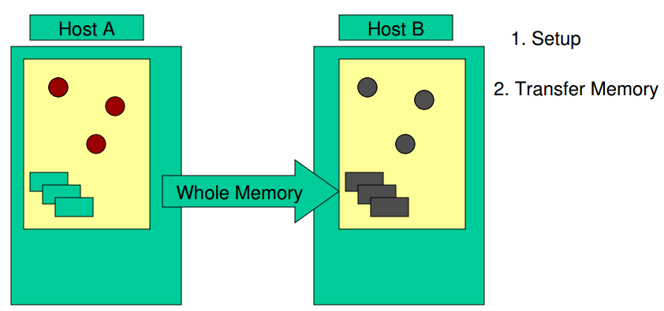

  `KVM Forum 2007`__

.. __: http://www.linux-kvm.org/wiki/images/5/5a/KvmForum2007$Kvm_Live_Migration_Forum_2007.pdf

KVM Live Migration
------------------

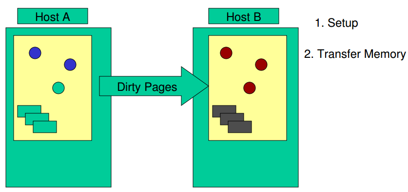

  `KVM Forum 2007`__

.. __: http://www.linux-kvm.org/wiki/images/5/5a/KvmForum2007$Kvm_Live_Migration_Forum_2007.pdf

KVM Live Migration
------------------

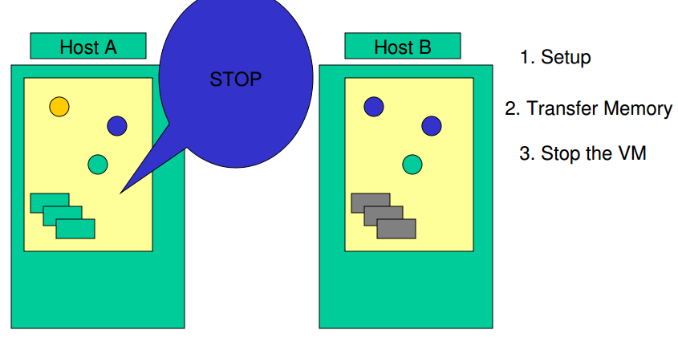

  `KVM Forum 2007`__

.. __: http://www.linux-kvm.org/wiki/images/5/5a/KvmForum2007$Kvm_Live_Migration_Forum_2007.pdf

KVM Live Migration
------------------

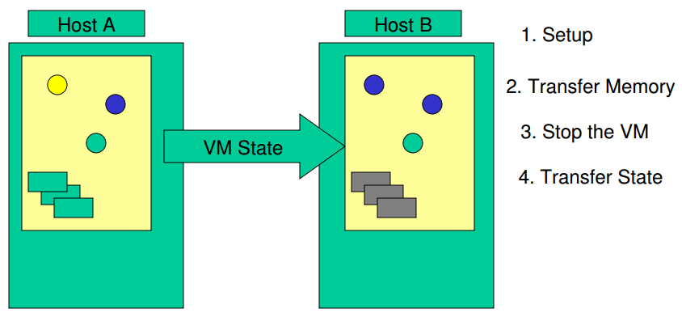

  `KVM Forum 2007`__

.. __: http://www.linux-kvm.org/wiki/images/5/5a/KvmForum2007$Kvm_Live_Migration_Forum_2007.pdf

KVM Live Migration
------------------

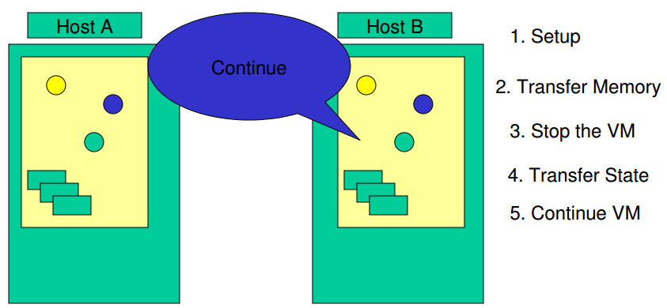

  `KVM Forum 2007`__

.. __: http://www.linux-kvm.org/wiki/images/5/5a/KvmForum2007$Kvm_Live_Migration_Forum_2007.pdf

Primary and Secondary Nodes
---------------------------

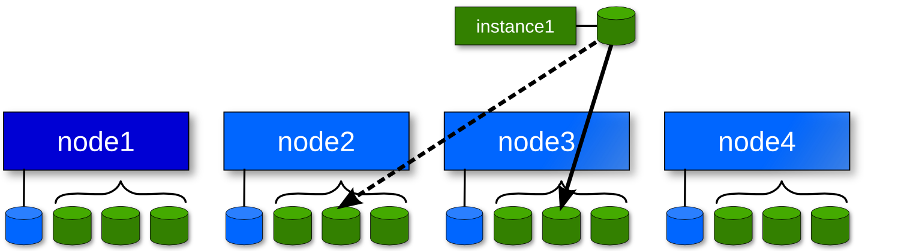

* Primary node is where the VM runs
* Secondary node is where its disk is replicated via DRBD. VM can be migrated
  over to it.

Cloud/System Image
------------------

  *A copy of an operating system including the entire state of the computer
  system stored in a non-volatile form such as a file.*

.. rst-class:: build

* A single file represents an entire filesystem
* Typically support extra features such as Copy-on-Write
* Snapshot support

Image Formats
-------------

.. rst-class:: build

**qcow/qcow2**
  * Used by QEMU/KVM
  * Stands for "QEMU Copy On Write"
**VHD (Virtual Hard Disk)**
  * Format created by Connectix which was later acquired by Microsoft
  * Used primarily by Hyper-V

Image Formats
-------------

.. rst-class:: build

**VMDK (Virtual Machine Disk)**
  * Initially developed by VMWare
  * An open format and used by VirtualBox, QEMU and Parellels
**AMI (Amazon Machine Image)**
  * Disk image format used on EC2
  * Compress, encrypted, signed and split into a series of 10MB checks and
    uploaded on S3
  * Contains an XML manifest file
  * Does not contain kernel image

Image files vs Block Devices
----------------------------

.. csv-table::
  :header: "Image Files", "Block Devices"

  "Easy to move around and create", "Requires use of LVM or other block device tools"
  "Can have a performance hit", "Typically has better performance"
  "Offer more features such as compression", "You can't 'overcommit' space with LVM"

Creating Images
---------------

*Various tools exist to create images. Some are distribution specific while
others aren't.*

**Oz**
  * Python CLI app that uses KVM to install a virtual machine image
  * Typically used to create RHEL-based images, but has support for Debian and
    Windows.
  * Uses an XML file format
**VMBuilder**
  * CLI tool that is typically used to create Debian or Ubuntu images

Creating Images
---------------

**BoxGrinder**
  * CLI tool that only works on Fedora but works on other RHEL systems
**VeeWee**
  * CLI tool to create Vagrant boxes, but can also create KVM images
**Packer**
  * CLI tool for creating machine images for multiple platforms
**imagefactory**
  * Tool that integrates with Oz to automate building, converting and uploading
    of images to different cloud providers.

Packer
------

* Machine image building tool created by Mitchell Hashimoto (of Vagrant fame)
* Written in Go

.. csv-table::

  Amazon EC2, Digital Ocean
  Docker, GCE
  Openstack, Parallels
  QEMU (kvm), Virtual Box
  VMWare

What problem does Packer solve?
-------------------------------

* One image building tool to rule them all
* Single configuration to create images across multiple platforms
* Integrates into the cloud/devops model well

Terminology
-----------

**Templates**
  JSON files containing the build information
**Builders**
  Platform specific building configuration
**Provisioners**
  Tools that install software after the initial OS install
**Post-processors**
  Actions to happen after the image has been built

Packer Build Steps
------------------

*This varies depending on which builder you use. The following is an example for
the QEMU builder*

#. Download ISO image
#. Create virtual machine
#. Boot virtual machine from the CD
#. Using VNC, type in commands in the installer to start an automated install
   via kickstart/preseed/etc
#. Packer automatically serves kickstart/preseed file with a built-in http
   server

Packer Build Steps
------------------

6. Packer waits for ssh to become available
#. OS installer runs and then reboots
#. Packer connects via ssh to VM and runs provisioner (if set)
#. Packer Shuts down VM and then runs the post processor (if set)
#. PROFIT!

How it works
------------

.. rst-class:: codeblock-very-small

.. code-block:: json

  {
    "builders": [
      {
        "boot_command": [
          "<tab> text ks=http://{{ .HTTPIP }}:{{ .HTTPPort }}/centos-7.0/ks-openstack.cfg",
          "<enter><wait>"
        ],
        "accelerator": "kvm",
        "boot_wait": "10s",
        "disk_size": 2048,
        "headless": true,
        "http_directory": "http",
        "iso_checksum": "df6dfdd25ebf443ca3375188d0b4b7f92f4153dc910b17bccc886bd54a7b7c86",
        "iso_checksum_type": "sha256",
        "iso_url": "{{user `mirror`}}/7.0.1406/isos/x86_64/CentOS-7.0-1406-x86_64-NetInstall.iso",
        "output_directory": "packer-centos-7.0-x86_64-openstack",
        "qemuargs": [ [ "-m", "1024m" ] ],
        "qemu_binary": "qemu-kvm",
        "shutdown_command": "echo 'centos'\|sudo -S /sbin/halt -h -p",
        "ssh_password": "centos",
        "ssh_port": 22,
        "ssh_username": "centos",
        "ssh_wait_timeout": "10000s",
        "type": "qemu",
        "vm_name": "packer-centos-7.0-x86_64"
      }
    ],
    "provisioners": [
      {
        "environment_vars": [
          "CHEF_VERSION={{user `chef_version`}}"
        ],
        "execute_command": "echo 'centos' | {{.Vars}} sudo -S -E bash '{{.Path}}'",
        "scripts": [
          "scripts/centos/osuosl.sh",
          "scripts/centos/fix-slow-dns.sh",
          "scripts/common/sshd.sh",
          "scripts/common/vmtools.sh",
          "scripts/common/chef.sh",
          "scripts/centos/openstack.sh",
          "scripts/centos/cleanup.sh",
          "scripts/common/minimize.sh"
        ],
        "type": "shell"
      }
    ],
    "variables": {
      "chef_version": "provisionerless",
      "mirror": "http://centos.osuosl.org"
    }
  }

Building the Image
------------------

.. rst-class:: codeblock-sm

.. code-block:: console

  $ packer build centos-7.0-x86_64-openstack.json
  qemu output will be in this color.

  ==> qemu: Downloading or copying ISO
      qemu: Downloading or copying: http://centos.osuosl.org/7.0.1406/isos/x86_64/CentOS-7.0-1406-x86_64-NetInstall.iso
  ==> qemu: Creating hard drive...
  ==> qemu: Starting HTTP server on port 8081
  ==> qemu: Found port for SSH: 3213.
  ==> qemu: Looking for available port between 5900 and 6000
  ==> qemu: Found available VNC port: 5947
  ==> qemu: Starting VM, booting from CD-ROM
      qemu: WARNING: The VM will be started in headless mode, as configured.
      qemu: In headless mode, errors during the boot sequence or OS setup
      qemu: won't be easily visible. Use at your own discretion.
  ==> qemu: Overriding defaults Qemu arguments with QemuArgs...
  ==> qemu: Waiting 10s for boot...
  ==> qemu: Connecting to VM via VNC
  ==> qemu: Typing the boot command over VNC...
  ==> qemu: Waiting for SSH to become available...

Provisioners
------------

.. csv-table::
  :widths: 30, 50

  Shell, Run either inline or shell scripts
  File Uploads, Upload files and use shell scripts to move files around as needed
  Ansible, Provision using playbook and role files
  Chef Client, Connect to a chef server and run chef
  Chef Solo, Run a Chef solo run by pointing to local cookbooks or uploading them
  Puppet Masterless, Run local manifests and modules
  Puppet Server, Connect to a puppet server and run puppet
  Salt, "Using Salt states, deploy a vm using Salt"

References
----------

* `KVM, OpenStack, and the Open Cloud -- Adam Jollans`__

.. __: http://www.socallinuxexpo.org/scale/13x/presentations/kvm-openstack-and-open-cloud

