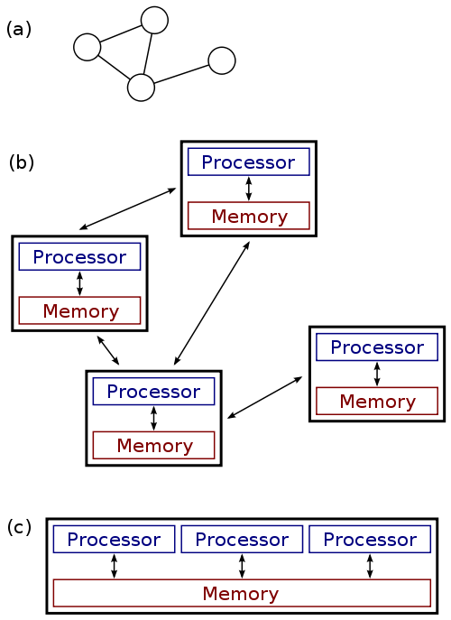
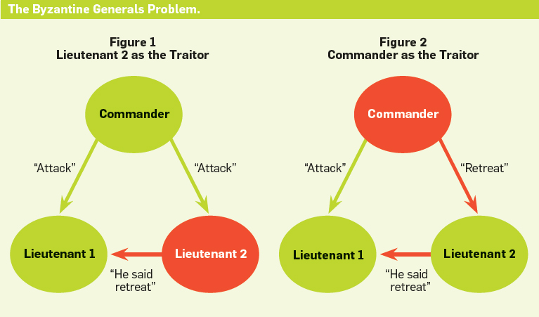

.. _22_distributed_systems:

Distributed Systems
===================

Definition
----------

..

  *Distributed systems are systems which are connected by a network, and use
  some form of message passing to communicate and compute correctly.*

Usefulness
----------

* Redundancy
* Fault-tolerance
* Horizontal Scalability & Parallelization

Problems
--------

What are some problems that can occur?

Two Generals Problem
--------------------

  Positions of the armies. Armies A1 and A2 need to communicate but their
  messengers may be captured by army B.

.. rst-class:: build

* Suppose you are one of two generals who are attempting to coordinate an attack
  on an enemy at a particular time.
* You can freely send as many messages as you like, although they have no
  guarantee of arrival.
* How can you guarantee that you and the other general attack at the same time?

Byzantine Fault
---------------

  In the Byzantine Generals Problem, a general must communicate his order to
  attack or retreat to his lieutenants, but any number of participants,
  including the general, could be a traitor.

.. rst-class:: build

* A Byzantine Fault is any problem in which two different observers observe
  different symptoms.
* Examples?

Byzantine Fault: Example
------------------------

.. rst-class:: build

* Suppose you run Nagios using passive checks, but unfortunately you observe
  that the networking out of your datacenter has issues from time to time.
* You have no control over these issues.
* Now suppose you set up a second Nagios server in another datacenter, and all
  machines send check results to both Nagios servers. What situations can occur?
* **Both Nagios servers will send agreeing alerts when something is down.
  Each Nagios server will send different alerts (or no alerts) when a Byzantine
  Fault occurs.**

Service Discovery
=================

Automated & Distributed Systems
-------------------------------

* Systems turn from pets to cattle
* We no longer really care which systems are up, we just want
  at least ``$X`` of them running at a time
* Why care at all where or how they run?

  * They still have to find each other!

Practical Goals
---------------

.. rst-class:: build

* Start services in any order
* Destroy services with confidence
* Restart servers safely
* Reconfigure services easily

Where is service foo?
---------------------

.. rst-class:: build

* Maybe here: ``127.0.0.1``
* Or here: ``10.0.1.10``
* And also here: ``foo.example.org``

Is service foo healthy / available?
-----------------------------------

.. rst-class:: build

* Yes: Great!
* No: Avoid or handle gracefully

What is service foo's configuration?
------------------------------------

.. rst-class:: build

* Access information
* Supported features
* Enabled / Disabled
* Expect *my* configuration to be modifiable

Where is the service foo leader or best choice?
-----------------------------------------------

.. rst-class:: build

* Locality
* Master / Slave
* Versions

Robust
------

.. rst-class:: build

* We can find the services
* We can avoid and handle unhealthy services
* It can be configured externally
* We can trust that it can retrieve all of this information

Solution attempts to this problem
---------------------------------

.. rst-class:: build

**Manual / Hardcoded**
  * Doesn't scale with services/nodes
  * Not resilient to failures
  * Localized visibility/auditability
  * Manual locality of services
**Config Management Problem**
  * Slow to react to changes
  * Not resilient to failures
  * Not *really* configurable by developers
  * Locality, monitoring, etc. manual

Solution attempts to this problem
---------------------------------

.. rst-class:: build

**LB Fronted Services**
  * Introduces different SPOF
  * How does the LB find services and its addresses and configure itself?
  * Solves some problems, though...

.. rst-class:: build

*What we need is something that automatically finds, and configures the
services..*

Service Discovery
-----------------

DHCP is a form of specialized service discovery. Why?

Service Discovery
-----------------

etcd, zookeeper, consul

* Typically arbitrary key-value stores (but *not* databases)

  * Why not nosql?

* Abstract the bootstrapping problem to just the service-discovery cluster
* CoreOS attempts to solve bootstrapping with `etcd discovery`_

.. _etcd discovery: https://discovery.etcd.io/

Resources
---------

* `Mitchell Hashimoto: Building Robust Systems w/ Service Discovery &
  Configuration`__

.. __: http://www.slideshare.net/DigitalOceanSlides/mitchell-hashimoto-building-robust-systems-w-service-discovery-configuration
