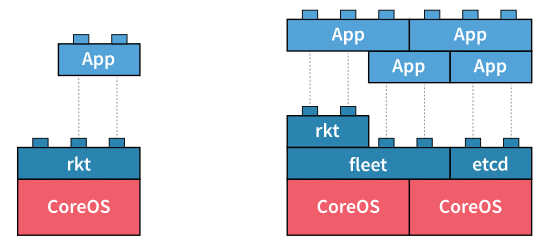

.. _22_distributed_systems:

Distributed Systems
===================

Definition
----------

.. image:: ../_static/distributed.png
  :align: right
  :width: 40%

..

  *Distributed systems are systems which are connected by a network, and use
  some form of message passing to communicate and compute correctly.*

Usefulness
----------

* Redundancy
* Fault-tolerance
* Horizontal Scalability & Parallelization
* Flexibility in deploying scalable web applications for developers

Problems
--------

What are some problems that can occur?

Two Generals Problem
--------------------

.. figure:: ../_static/two-generals.svg
  :width: 60%
  :align: center

  Positions of the armies. Armies A1 and A2 need to communicate but their
  messengers may be captured by army B.

.. rst-class:: build

* Suppose you are one of two generals who are attempting to coordinate an attack
  on an enemy at a particular time.
* You can freely send as many messages as you like, although they have no
  guarantee of arrival.
* How can you guarantee that you and the other general attack at the same time?

Byzantine Fault
---------------

.. figure:: ../_static/byzantine-fault.jpg
  :width: 60%
  :align: center

  In the Byzantine Generals Problem, a general must communicate his order to
  attack or retreat to his lieutenants, but any number of participants,
  including the general, could be a traitor.

.. rst-class:: build

* A Byzantine Fault is any problem in which two different observers observe
  different symptoms.
* Examples?

Byzantine Fault: Real World Example
-----------------------------------

.. rst-class:: build

* Suppose you run Nagios using passive checks, but unfortunately you observe
  that the networking out of your datacenter has issues from time to time.
* You have no control over these issues.
* Now suppose you set up a second Nagios server in another datacenter, and all
  machines send check results to both Nagios servers. What situations can occur?
* **Both Nagios servers will send agreeing alerts when something is down.
  Each Nagios server will send different alerts (or no alerts) when a Byzantine
  Fault occurs.**

Service Discovery
=================

Automated & Distributed Systems
-------------------------------

* Systems turn from pets to cattle
* We no longer really care which systems are up, we just want
  at least ``$X`` of them running at a time
* Why care at all where or how they run?

  * They still have to find each other!

Practical Goals
---------------

.. rst-class:: build

* Start services in any order
* Destroy services with confidence
* Restart servers safely
* Reconfigure services easily

Where is service foo?
---------------------

.. rst-class:: build

* Maybe here: ``127.0.0.1``
* Or here: ``10.0.1.10``
* And also here: ``foo.example.org``

Is service foo healthy / available?
-----------------------------------

.. rst-class:: build

* Yes: Great!
* No: Avoid or handle gracefully

What is service foo's configuration?
------------------------------------

.. rst-class:: build

* Access information
* Supported features
* Enabled / Disabled
* Expect *my* configuration to be modifiable

Where is the service foo leader or best choice?
-----------------------------------------------

.. rst-class:: build

* Locality
* Master / Slave
* Versions

Robust
------

.. rst-class:: build

* We can find the services
* We can avoid and handle unhealthy services
* It can be configured externally
* We can trust that it can retrieve all of this information

Solution attempts to this problem
---------------------------------

.. rst-class:: build

**Manual / Hardcoded**
  * Doesn't scale with services/nodes
  * Not resilient to failures
  * Localized visibility/auditability
  * Manual locality of services
**Config Management Problem**
  * Slow to react to changes
  * Not resilient to failures
  * Not *really* configurable by developers
  * Locality, monitoring, etc. manual

Solution attempts to this problem
---------------------------------

.. rst-class:: build

**LB Fronted Services**
  * Introduces different SPOF
  * How does the LB find services and its addresses and configure itself?
  * Solves some problems, though...

.. rst-class:: build

*What we need is something that automatically finds, and configures the
services..*

Service Discovery
-----------------

DHCP is a form of specialized service discovery. Why?

Service Discovery
-----------------

etcd, zookeeper, consul

.. rst-class:: build

* Typically arbitrary key-value stores (but *not* databases)

  * Why not nosql?

* Abstract the bootstrapping problem to just the service-discovery cluster
* CoreOS attempts to solve bootstrapping with `etcd discovery`_

.. rst-class:: build

Protocols:

.. rst-class:: build

**DNS**
  Legacy friendly, no application changes are required
**HTTP**
  Returns rich metadata

.. _etcd discovery: https://discovery.etcd.io/

CoreOS
------

.. rst-class:: build

**CoreOS**
  Operating System that is built and designed with distributed systems in mind.
**etcd**
  Service Discovery and consensus
**fleet**
  Distributed init system using systemd
**rkt**
  CoreOS container engine. Docker is also a container engine that CoreOS
  supports.
**App**
  Your containerized application

etcd example
------------

.. rst-class:: codeblock-sm

.. code-block:: console

  $ ssh core@140.211.168.XXX
  $ systemctl start etcd2
  $ etcdctl set /message Hello
  Hello
  $ curl -L -X PUT http://127.0.0.1:2379/v2/keys/message -d value="Hello"
  {"action":"set","node":{"key":"/message","value":"Hello","modifiedIndex":5,"createdIndex":5},"prevNode":{"key":"/message","value":"Hello","modifiedIndex":4,"createdIndex":4}}
  $ etcdctl get /message
  Hello
  $ curl -L http://127.0.0.1:2379/v2/keys/message
  {"action":"get","node":{"key":"/message","value":"Hello","modifiedIndex":5,"createdIndex":5}}
  $ etcdctl rm /message
  PrevNode.Value: Hello

CoreOS Cluster Discovery
------------------------

.. rst-class:: build

* Bootstrapping etcd can be difficult.
* CoreOS offers a public discovery service: https://discovery.etcd.io/

.. rst-class:: build

.. code-block:: console

  $ curl -w "\n" 'https://discovery.etcd.io/new?size=3'
  https://discovery.etcd.io/6a28e078895c5ec737174db2419bb2f3

Bootstrapping with cloud-init
-----------------------------

Create a ``cloud-config.yml`` file with the contents of the discovery URL.

.. rst-class:: codeblock-sm

.. code-block:: yaml

  #cloud-config

  coreos:
    etcd2:
      # generate a new token for each unique cluster from https://discovery.etcd.io/new?size=3
      # specify the initial size of your cluster with ?size=X
      discovery: https://discovery.etcd.io/6a28e078895c5ec737174db2419bb2f3
      # multi-region and multi-cloud deployments need to use $public_ipv4
      advertise-client-urls: http://$private_ipv4:2379,http://$private_ipv4:4001
      initial-advertise-peer-urls: http://$private_ipv4:2380
      # listen on both the official ports and the legacy ports
      # legacy ports can be omitted if your application doesn't depend on them
      listen-client-urls: http://0.0.0.0:2379,http://0.0.0.0:4001
      listen-peer-urls: http://$private_ipv4:2380
    units:
      - name: etcd2.service
        command: start
      - name: fleet.service
        command: start

Bootstrap a three node etcd cluster
-----------------------------------

.. code-block:: console

  $ nova boot --image "CoreOS" --flavor cs312 --key-name ramereth \
    --user-data ./cloud-config.yml --security-groups all etcd1
  # Wait for first node to start the etcd cluster and now watch the
  # logs as we spin up new instances
  $ journalctl -u etcd2 -f
  $ nova boot --image "CoreOS" --flavor cs312 --key-name ramereth \
    --user-data ./cloud-config.yml --security-groups all etcd2
  $ nova boot --image "CoreOS" --flavor cs312 --key-name ramereth \
    --user-data ./cloud-config.yml --security-groups all etcd3

Fleet Example
-------------

.. rst-class:: codeblock-sm

.. code-block:: console

  $ ssh core@140.211.168.XXX
  # Start etcd2 and fleet
  $ systemctl start etcd2 fleet
  # List machines seen in fleet
  $ fleetctl list-machines
  MACHINE     IP            METADATA
  0de27f87... 192.168.68.2  -
  # Create echo container from Monday
  cat <<EOF > Dockerfile
  FROM centos
  MAINTAINER cs312@osuosl.org # Change your email here

  ADD http://ilab.cs.byu.edu/python/code/echoserver-simple.py /echoserver-simple.py
  EXPOSE 50000
  CMD ["python", "/echoserver-simple.py"]
  EOF
  $ docker build -t cs312/echo .
  # Create systemd unit from Monday
  cat <<EOF > echo.service
  [Unit]
  Description=echo service
  BindsTo=echo.service

  [Service]
  ExecStartPre=-/usr/bin/docker kill echo
  ExecStartPre=-/usr/bin/docker rm echo
  ExecStart=/usr/bin/docker run --name echo -p 50000:50000 cs312/echo
  ExecStop=/usr/bin/docker stop echo
  EOF
  $ fleetctl submit echo
  Unit echo.service inactive
  $ fleetctl load echo
  Unit echo.service loaded on 0de27f87.../192.168.68.2
  $ fleetctl list-units
  UNIT          MACHINE                   ACTIVE    SUB
  echo.service  0de27f87.../192.168.68.2  inactive  dead
  $ fleetctl start echo
  Unit echo.service launched on 0de27f87.../192.168.68.2
  $ fleetctl list-units
  UNIT          MACHINE                   ACTIVE  SUB
  echo.service  0de27f87.../192.168.68.2  active  running
  $ ncat localhost 50000
  foo
  foo

Kubernetes (k8)
---------------

.. image:: ../_static/k8.png
  :align: right
  :width: 30%

..

  *Kubernetes is an open-source platform for automating deployment, scaling, and
  operations of application containers across clusters of hosts* --
  http://kubernetes.io/

.. rst-class:: build

* Google open-source project launched in June 2014
* Kubernetes is Greek for "helmsman" or "pilot"
* Development and design heavily influenced by `Google's Borg System`__
* k8 can be used on top of CoreOS (Tectonic is their commercial product)

.. __: https://research.google.com/pubs/pub43438.html

Kubernetes Components
---------------------

.. rst-class:: build

**Pods**
  Basic scheduling unit which consists of one or more containers that are
  guaranteed to be colocated on the host machine. Each pod is assigned a unique
  IP (within the cluster) which allows applications to use ports without the
  risk of conflict.
**Labels and Selectors**
  Labels are key/value pairs that are attached to objects, such as pods. Labels
  are intended to be used to specify identifying attributes of objects that are
  meaningful and relevant to users, but which do not directly imply semantics to
  the core system

Kubernetes Components
---------------------

.. rst-class:: build

**Replication Controllers**
  A replication controller ensures that a specified number of pod "replicas" are
  running at any one time. The replication controller simply ensures that the
  desired number of pods matches its label selector and are operational.
**Services**
  A set of pods that work together, such as one tier of a multi-tier
  application.

Kubernetes Demo Setup
---------------------

.. rst-class:: codeblock-sm

.. code-block:: console

  # bind local port 8001 to localhost:8001 on remote server, we will use this
  # later
  $ ssh -L8001:localhost:8001 core@140.211.168.XXX
  # Run etcd
  $ docker run --net=host -d gcr.io/google_containers/etcd:2.0.12 /usr/local/bin/etcd \
    --addr=127.0.0.1:4001 --bind-addr=0.0.0.0:4001 --data-dir=/var/etcd/data
  # Run master k8
  $ docker run \
    --volume=/:/rootfs:ro \
    --volume=/sys:/sys:ro \
    --volume=/dev:/dev \
    --volume=/var/lib/docker/:/var/lib/docker:ro \
    --volume=/var/lib/kubelet/:/var/lib/kubelet:rw \
    --volume=/var/run:/var/run:rw \
    --net=host \
    --pid=host \
    --privileged=true \
    -d \
    gcr.io/google_containers/hyperkube:v1.1.3 \
    /hyperkube kubelet --containerized --hostname-override="127.0.0.1" \
                       --address="0.0.0.0" --api-servers=http://localhost:8080 \
                       --config=/etc/kubernetes/manifests
  # Run service proxy
  $ docker run -d --net=host --privileged gcr.io/google_containers/hyperkube:v1.1.3 \
    /hyperkube proxy --master=http://127.0.0.1:8080 --v=2

  # Download kubectl binary and put it somewhere in our $PATH
  $ mkdir -p /opt/bin
  $ wget -O /opt/bin/kubectl https://goo.gl/vkEeer
  $ chmod +x /opt/bin/kubectl

  # Ensure we can see the local node running
  $ kubectl get nodes
  NAME        LABELS                             STATUS    AGE
  127.0.0.1   kubernetes.io/hostname=127.0.0.1   Ready     30s

Kubernetes Rolling Update Demo
------------------------------

.. rst-class:: codeblock-sm

.. code-block:: console

  # Download K8 repo tarball
  $ wget https://github.com/kubernetes/kubernetes/archive/release-1.1.zip
  $ unzip release-1.1.zip && cd kubernetes-release-1.1

  # Run demo frontend and access via http://localhost:8001/static
  $ kubectl proxy --www=docs/user-guide/update-demo/local/ &

  # Show pods
  $ kubectl get pods

  # Run the replication controller
  $ kubectl create -f docs/user-guide/update-demo/nautilus-rc.yaml

  # Try scaling the replication controller
  $ kubectl scale rc update-demo-nautilus --replicas=4

  # Update the docker image
  $ kubectl rolling-update update-demo-nautilus --update-period=5s \
    -f docs/user-guide/update-demo/kitten-rc.yaml

  # Bring down the pods
  $ kubectl delete rc update-demo-kitten

Resources
---------

* `Mitchell Hashimoto: Building Robust Systems w/ Service Discovery &
  Configuration`__
* `Getting started with etcd`__
* `CoreOS Cluster Discovery`__
* `Running Kubernetes locally via Docker`__
* `Rolling update example with Kubernetes`__

.. __: http://www.slideshare.net/DigitalOceanSlides/mitchell-hashimoto-building-robust-systems-w-service-discovery-configuration
.. __: https://coreos.com/etcd/docs/latest/getting-started-with-etcd.html
.. __: https://coreos.com/os/docs/latest/cluster-discovery.html
.. __: http://kubernetes.io/v1.1/docs/getting-started-guides/docker.html
.. __: http://kubernetes.io/v1.1/docs/user-guide/update-demo/README.html
