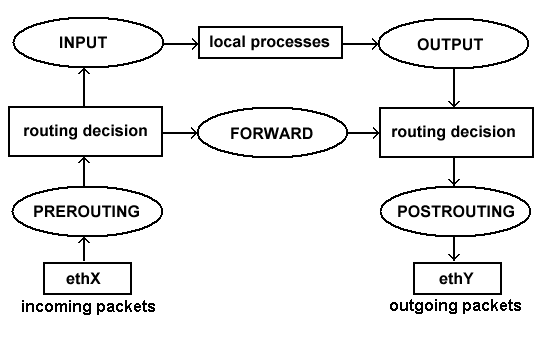

.. _23_security:

Security
========

Iptables, SELinux etc

IPTables
========

IPTables / NetFilter
--------------------

  *iptables is the userspace command line program used to configure the Linux
  2.4.x and later packet filtering ruleset. It is targeted towards system
  administrators.* -- netfilter.org

.. rst-class:: build

* ``iptables`` is the userspace CLI to configure firewall rules on Linux
* Netfilter is the kernel module(s) built into Linux that does the actual
  filtering
* ``ip6tables`` applies to IPv6 filters / ``arptables`` applies to ARP filters /
  ``ebtables`` applies to Ethernet frame filters

IPTables Concepts
-----------------

.. rst-class:: build

* Uses the concept of IP addresses, protocols and ports
* IPTables places rules into predefined chains (INPUT, OUTPUT and FORWARD) that
  are checked against any network traffic (IP packets) relevant to the packet
* These actions are referred to as targets, of which the two most common are
  DROP and ACCEPT

Chains
------

.. rst-class:: build

**INPUT**
  All packets destined for the host computer
**OUTPUT**
  All packets originating from the host computer
**FORWARD**
  All packets neither destined for nor originating from the host computer, but
  passing through (routed by) the host computer. This chain is used if you are
  using your computer as a router.

.. rst-class:: build

IPTables Rules workflow
-----------------------

.. rst-class:: build

#. Rules are added in a list to each chain
#. A packet is checked against each rule in turn, starting at the top
#. If it matches a rule, then an action is taken (ACCEPT or DROP)
#. Once a rule has been matched and an action taken, then the packet is
   processed and isn't processed by further rules in the chain.
#. If a packet passes down through all the rules in the chain and reaches the
   bottom without being matched against any rule, then the default action for
   that chain is taken.
#. This is referred to as the default policy and may be set to either ACCEPT or
   DROP the packet.

Default firewall policies
-------------------------

.. rst-class:: build

**DROP all packets by default**
  Add rules to specifically allow packets that may be from trusted IP addresses
  or ports.
**ACCEPT all packages by default**
  Block packets from specific IP addresses or ports.

.. rst-class:: build

* Which is more ideal?
* **DROP by default!**

Hands on IPTables
-----------------

.. code-block:: console

  $ lsmod | grep ip_tables
  ip_tables              27240  1 iptable_filter
  $ iptables -L
  Chain INPUT (policy ACCEPT)
  target     prot opt source               destination

  Chain FORWARD (policy ACCEPT)
  target     prot opt source               destination

  Chain OUTPUT (policy ACCEPT)
  target     prot opt source               destination
  $ iptables -S
  -P INPUT ACCEPT
  -P FORWARD ACCEPT
  -P OUTPUT ACCEPT

IPTables on CentOS 7
--------------------

.. rst-class:: codeblock-sm

.. code-block:: console

  $ yum install iptables-services
  $ systemctl start iptables
  $ iptables -L
  Chain INPUT (policy ACCEPT)
  target     prot opt source               destination
  ACCEPT     all  --  anywhere             anywhere             state RELATED,ESTABLISHED
  ACCEPT     icmp --  anywhere             anywhere
  ACCEPT     all  --  anywhere             anywhere
  ACCEPT     tcp  --  anywhere             anywhere             state NEW tcp dpt:ssh
  REJECT     all  --  anywhere             anywhere             reject-with icmp-host-prohibited

  Chain FORWARD (policy ACCEPT)
  target     prot opt source               destination
  REJECT     all  --  anywhere             anywhere             reject-with icmp-host-prohibited

  Chain OUTPUT (policy ACCEPT)
  target     prot opt source               destination
  $ iptables -S
  -P INPUT ACCEPT
  -P FORWARD ACCEPT
  -P OUTPUT ACCEPT
  -A INPUT -m state --state RELATED,ESTABLISHED -j ACCEPT
  -A INPUT -p icmp -j ACCEPT
  -A INPUT -i lo -j ACCEPT
  -A INPUT -p tcp -m state --state NEW -m tcp --dport 22 -j ACCEPT
  -A INPUT -j REJECT --reject-with icmp-host-prohibited
  -A FORWARD -j REJECT --reject-with icmp-host-prohibited

Simple Rule Set
---------------

.. rst-class:: codeblock-sm

.. code-block:: console

  $ systemctl stop iptables
  $ iptables -P INPUT ACCEPT
  $ iptables -F
  $ iptables -A INPUT -i lo -j ACCEPT
  $ iptables -A INPUT -m state --state ESTABLISHED,RELATED -j ACCEPT
  $ iptables -A INPUT -p tcp --dport 22 -j ACCEPT
  $ iptables -P INPUT DROP
  $ iptables -P FORWARD DROP
  $ iptables -P OUTPUT ACCEPT
  $ iptables -L -v

Simple Rule Set in detail
-------------------------

.. rst-class:: build

``iptables -P INPUT ACCEPT``
  If connecting remotely we must first temporarily set the default policy on the
  INPUT chain to ACCEPT otherwise once we flush the current rules we will be
  locked out of our server.
``iptables -F``
  We used the ``-F`` switch to flush all existing rules so we start with a clean
  state from which to add new rules.

Simple Rule Set in detail
-------------------------

``iptables -A INPUT -i lo -j ACCEPT``

* We use the ``-A`` switch to append (or add) a rule to a specific chain, the
  ``INPUT`` chain in this instance.
* Then we use the ``-i`` switch (for interface) to specify packets matching or
  destined for the ``lo`` (localhost, 127.0.0.1) interface
* And finally ``-j`` (jump) to the target action for packets matching the rule -
  in this case ACCEPT.
* So this rule will allow all incoming packets destined for the
  localhost interface to be accepted.
* This is generally required as many software applications expect to be able to
  communicate with the localhost adaptor.

Simple Rule Set in detail
-------------------------

.. rst-class:: codeblock-sm

``iptables -A INPUT -m state --state ESTABLISHED,RELATED -j ACCEPT``

* This is the rule that does most of the work, and again we are adding (``-A``)
  it to the INPUT chain.
* Here we're using the ``-m`` switch to load a module (state).
* The state module is able to examine the state of a packet and determine if it
  is NEW, ESTABLISHED or RELATED.
* NEW refers to incoming packets that are new incoming connections that weren't
  initiated by the host system.
* ESTABLISHED and RELATED refers to incoming packets that are part of an already
  established connection or related to and already established connection.

Simple Rule Set in detail
-------------------------

``iptables -A INPUT -p tcp --dport 22 -j ACCEPT``

* Here we add a rule allowing SSH connections over tcp port 22.
* This is to prevent accidental lockouts when working on remote systems over an
  SSH connection. We will explain this rule in more detail later.

Simple Rule Set in detail
-------------------------

``iptables -P INPUT DROP``

* The ``-P`` switch sets the default policy on the specified chain.
* So now we can set the default policy on the INPUT chain to DROP.
* This means that if an incoming packet does not match one of the following
  rules it will be dropped.
* If we were connecting remotely via SSH and had not added the rule above, we
  would have just locked ourself out of the system at this point.

Simple Rule Set in detail
-------------------------

``iptables -P FORWARD DROP``
  Similarly, here we've set the default policy on the FORWARD chain to DROP as
  we're not using our computer as a router so there should not be any packets
  passing through our computer.
``iptables -P OUTPUT ACCEPT``
  And finally, we've set the default policy on the OUTPUT chain to ACCEPT as we
  want to allow all outgoing traffic (as we trust our users).
``iptables -L -v``
  Finally, we can list (``-L``) the rules we've just added to check they've been
  loaded correctly.

Saving rules
------------

.. code-block:: console

  $ service iptables save
  iptables: Saving firewall rules to /etc/sysconfig/iptables:[  OK  ]
  $ cat /etc/sysconfig/iptables
  # Generated by iptables-save v1.4.21 on Mon Mar  7 20:49:54 2016
  *filter
  :INPUT DROP [37:12136]
  :FORWARD DROP [0:0]
  :OUTPUT ACCEPT [57:5712]
  -A INPUT -i lo -j ACCEPT
  -A INPUT -m state --state RELATED,ESTABLISHED -j ACCEPT
  -A INPUT -p tcp -m tcp --dport 22 -j ACCEPT
  COMMIT
  # Completed on Mon Mar  7 20:49:54 2016

  # Manually saving or restoring
  $ iptables-save > /etc/sysconfig/iptables
  $ iptables-restore < /etc/sysconfig/iptables

SELinux
=======

Resources
---------

* `CentOS Iptables Documentation`__
* `RHEL 7 Firewall Documentation`__
* `RHEL 7 SELinux Documentation`__

.. __: https://wiki.centos.org/HowTos/Network/IPTables
.. __: https://access.redhat.com/documentation/en-US/Red_Hat_Enterprise_Linux/7/html/Security_Guide/sec-Using_Firewalls.html
.. __: https://access.redhat.com/documentation/en-US/Red_Hat_Enterprise_Linux/7/html/SELinux_Users_and_Administrators_Guide/
