.. _23_virtualization:

Virtualization
==============

History, KVM and Openstack

History of Virtualization
-------------------------

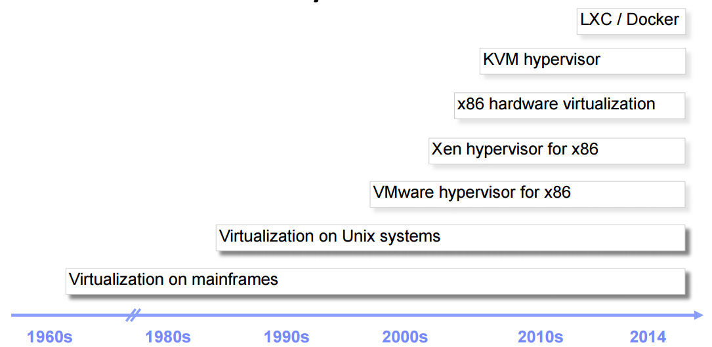

  Adam Jollans - IBM - SCALE 13x

Virtualization Framework Generalized
------------------------------------

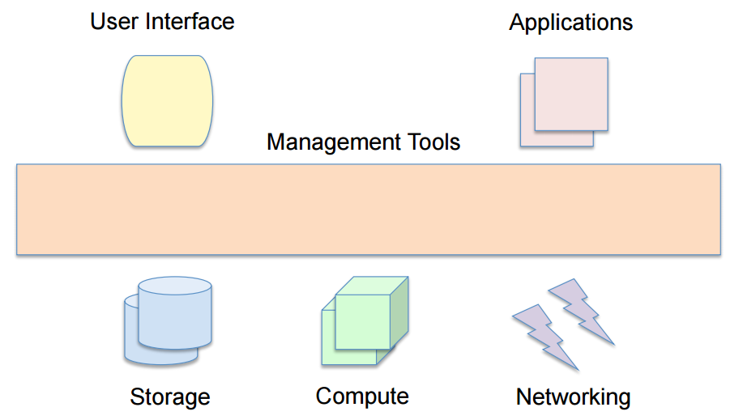

  Adam Jollans - IBM - SCALE 13x

Virtualization Framework - KVM
------------------------------

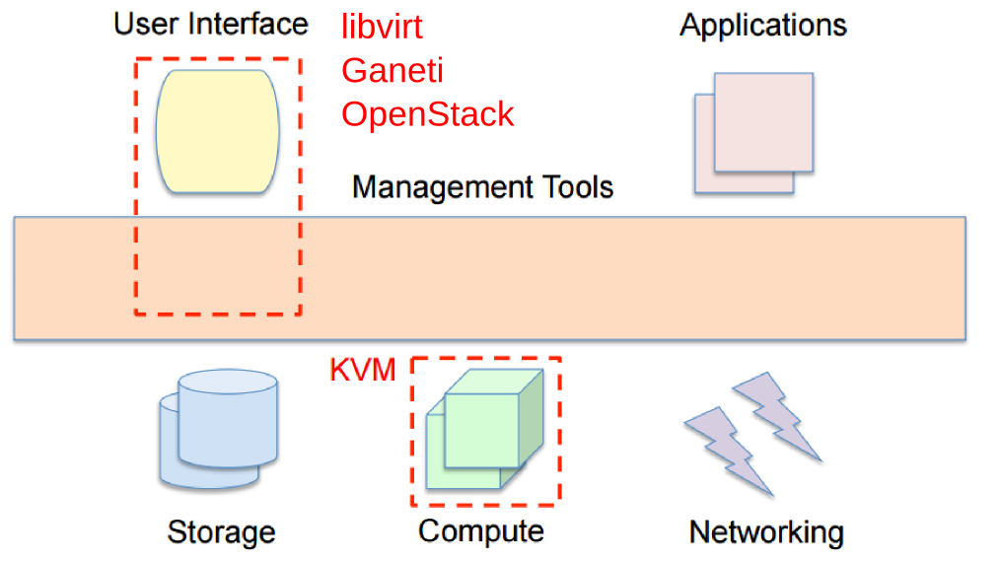

  Adam Jollans - IBM - SCALE 13x

KVM
---

Open Source hypervisor based on Linux

**KVM**
  * Kernel-Based Virtual Machine
  * Kernel module that turns Linux into a virtual machine monitor
  * Merged into mainline Linux

**QEMU**
  * Emulator used for I/O device virtualization
  * Runs as a user-space process
  * Avi Kivity began the development of KVM at Qumranet in the mid-2000s

Processors Supported
--------------------

* x86 with virtualization extensions
* Intel VT-x
* AMD (AMD-V)
* POWER8
* IBM z Systems
* ARM64

KVM Visualized
--------------

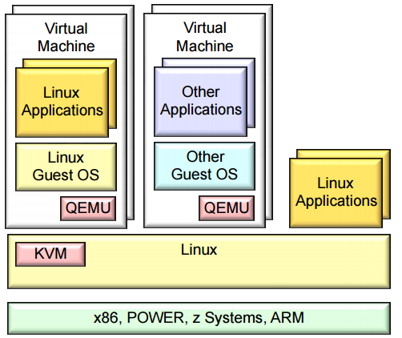

  Adam Jollans - IBM - SCALE 13x

KVM Command Line
----------------

KVM has **a lot** of options

.. code-block:: bash

  # Create a virtual disk file
  $ qemu-img create -f qcow2 disk.img 10g

  # Start a VM up and boot to an ISO
  $ qemu-system-x86_64 -hda disk.img -cdrom \
    /path/to/CentOS-6.6-x86_64-minimal.iso -boot d -m 1024m

KVM on OpenStack
----------------

.. rst-class:: codeblock-sm

::

  /usr/libexec/qemu-kvm -name instance-00000baa -S -M rhel6.6.0 -cpu
  Westmere,+rdtscp,+pdpe1gb,+dca,+pcid,+pdcm,+xtpr,+tm2,+est,+smx,+vmx,+ds_cpl,+monitor,+dtes64,+pclmuldq,+pbe,+tm,+ht,+ss,+acpi,+ds,+vme
  -enable-kvm -m 512 -realtime mlock=off -smp 1,sockets=1,cores=1,threads=1 -uuid
  96bea55c-6d58-4dcf-bc52-09aed81c0cee -smbios type=1,manufacturer=RDO
  Project,product=OpenStack
  Nova,version=2014.1.3-3.el6,serial=44454c4c-3400-1051-8059-c7c04f534b31,uuid=96bea55c-6d58-4dcf-bc52-09aed81c0cee
  -nodefconfig -nodefaults -chardev
  socket,id=charmonitor,path=/var/lib/libvirt/qemu/instance-00000baa.monitor,server,nowait
  -mon chardev=charmonitor,id=monitor,mode=control -rtc base=utc,driftfix=slew
  -no-kvm-pit-reinjection -no-shutdown -device
  piix3-usb-uhci,id=usb,bus=pci.0,addr=0x1.0x2 -drive
  file=/var/lib/nova/instances/96bea55c-6d58-4dcf-bc52-09aed81c0cee/disk,if=none,id=drive-virtio-disk0,format=qcow2,cache=none
  -device
  virtio-blk-pci,scsi=off,bus=pci.0,addr=0x4,drive=drive-virtio-disk0,id=virtio-disk0,bootindex=1
  -drive
  file=/var/lib/nova/instances/96bea55c-6d58-4dcf-bc52-09aed81c0cee/disk.swap,if=none,id=drive-virtio-disk1,format=qcow2,cache=none
  -device
  virtio-blk-pci,scsi=off,bus=pci.0,addr=0x5,drive=drive-virtio-disk1,id=virtio-disk1
  -netdev tap,fd=35,id=hostnet0,vhost=on,vhostfd=39 -device
  virtio-net-pci,netdev=hostnet0,id=net0,mac=fa:16:3e:35:5f:f4,bus=pci.0,addr=0x3
  -chardev
  file,id=charserial0,path=/var/lib/nova/instances/96bea55c-6d58-4dcf-bc52-09aed81c0cee/console.log
  -device isa-serial,chardev=charserial0,id=serial0 -chardev pty,id=charserial1
  -device isa-serial,chardev=charserial1,id=serial1 -device usb-tablet,id=input0
  -vnc 10.1.0.114:11 -k en-us -vga cirrus -device
  virtio-balloon-pci,id=balloon0,bus=pci.0,addr=0x6 -msg timestamp=on

Xen
---

Micro-kernel hypervisor for Linux or BSD

* Originated as a research project at the University of Cambridge
* Publicly released in 2003 under the GPLv2

**Domains**
  * Dom0 -- Domain that has privileged access to hardware
  * DomU -- Unprivileged domains (VMs)

**Types of Virtualization**
  * Paravirtualization -- Simulates real hardware (PV Guests)
  * Hardware Virtual Machine (HVM) -- uses cpu supported virtualization

Xen Visualized
---------------

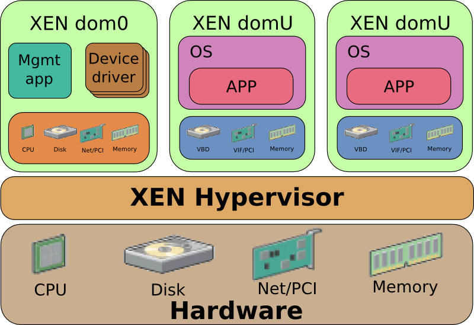

KVM vs. Xen
-----------

.. csv-table::
  :header: KVM, Xen

  Less mature, More mature
  Runs like a normal unix app, Blackbox feel for how it works
  Always been in mainline, Had trouble getting into mainline Linux
  Requires CPU support, Doesn't require CPU support
  Development is very active and growing, Development has slowed a bit
  "Used by newer cloud providers (i.e. GCE, DigitalOcean)", "Used by Amazon EC2"

Libvirt -- KVM management
-------------------------

Libvirt is an open source API daemon that standardizes management of various
virtualization platforms.

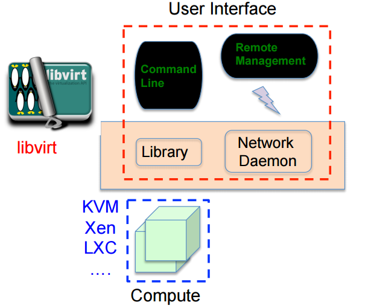

  Adam Jollans - IBM - SCALE 13x

Libvirt Features
----------------

* Manages multiple hypervisors
* Powerful CLI tool, but can be complex to use
* Provides a network daemon to provide API access and remote access
* Base tool for other management tools:

  * OpenStack, oVirt, virt-manager, Kimchi to just name a few...

OpenStack
---------

Open source cloud computing platform

* Started in 2010 as a joint venture with NASA and Rackspace
* Has a modular architecture
* Very complicated, but has the potential to scale very well
* Development ongoing, API's/Architecture changes on each release
* Open Development, Design and Community governance
* Combines compute, storage and network into one suite
* Multi-site

OpenStack Visualized
--------------------

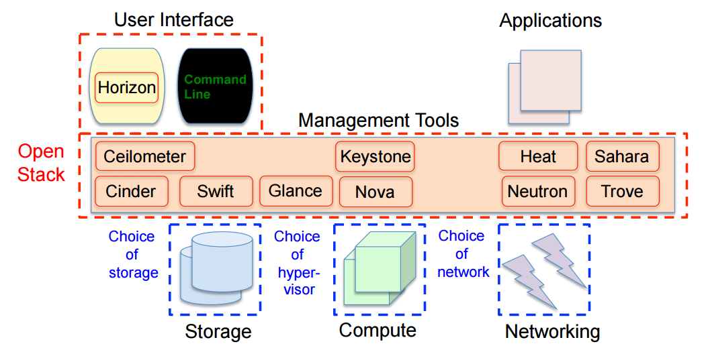

  Adam Jollans - IBM - SCALE 13x

Nova - Compute Service
----------------------

**Manages the VM life cycle**
  * Starting and Stopping VMs
  * Scheduling and monitoring VMs
  * Uses libvirt directly

**Key components**
  * API
  * Database
  * Scheduler -- where to put the VMs?
  * Compute nodes and plugins

**VM Images**
  * Uses Glance and Swift

Nova Visualized
---------------

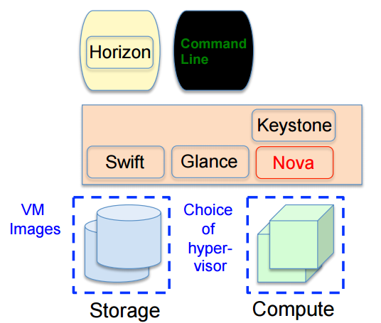

  Adam Jollans - IBM - SCALE 13x

Keystone - Authentication Service
---------------------------------

**Manages Security**
  * Service for all other modules
  * Authentication
  * Authorization

**Key Components**
  * API
  * Backends

    * Token
    * Catalog
    * Policy
    * Identity

Keystone Visualized
-------------------

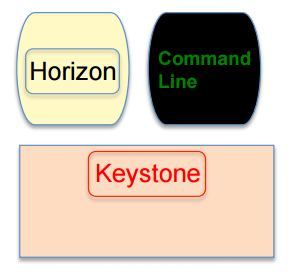

  Adam Jollans - IBM - SCALE 13x

Cinder - Block Storage Service
------------------------------

**Manages persistent block storage**
  * Provides volumes to running instances
  * Pluggable driver architecture

    * LVM, iSCSI and other storage backends

  * Can provide High Availability depending on implementation

**Key Components**
  * API, Queue
  * Database, Scheduler
  * Storage plug-ins

**Authentication**
  * Keystone

Cinder Visualized
-------------------

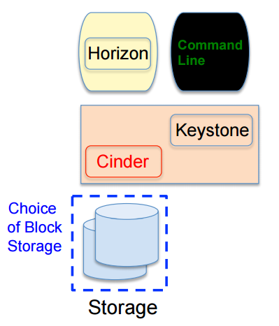

  Adam Jollans - IBM - SCALE 13x

Neutron - Networking Service
----------------------------

**Manages Networking Connectivity**
  * Provides networking as a service for VMs
  * Pluggable driver architecture
  * Flat Networks / VLANs
  * Floating IPs
  * Software Defined Networking (SDN)

**Key Components**
  * API, Queue
  * Database, Scheduler
  * Agent, Networking plug-ins

**Authentication**
  * Keystone

Neutron Visualized
-------------------

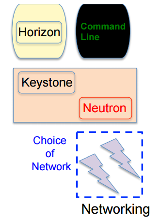

  Adam Jollans - IBM - SCALE 13x

Glance - Image Service
----------------------

**Manages VM Images**
  * Catalog of images
  * Search and registration
  * Fetch and delivery

**Key components**
  * API, Registry
  * Database

**Authentication**
  * Keystone

**Storage of VM Images**
  * Swift
  * Local file system

Glance Visualized
-----------------

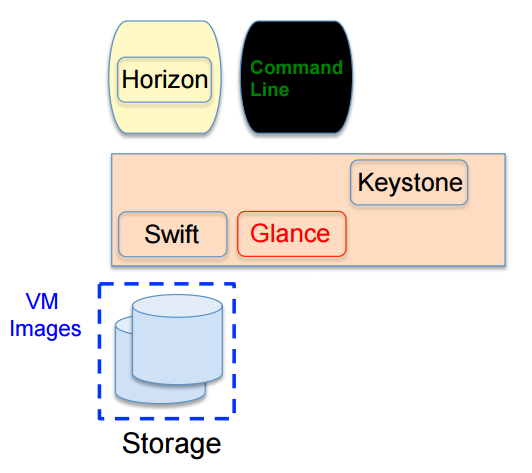

  Adam Jollans - IBM - SCALE 13x

Swift - Object Storage Service
------------------------------

**Manages Unstructured Object Storage**
  * Highly Scalable
  * Durable - three times replication
  * Distributed

**Key Components**
  * Proxy / API
  * Rings

    * Accounts, Containers and Objects

  * Data stores

**Authentication**
  * Keystone

Swift Visualized
----------------

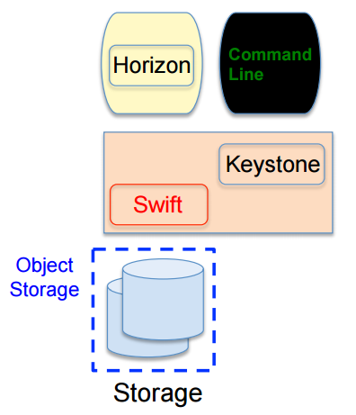

  Adam Jollans - IBM - SCALE 13x

Provision a VM on OpenStack
----------------------------

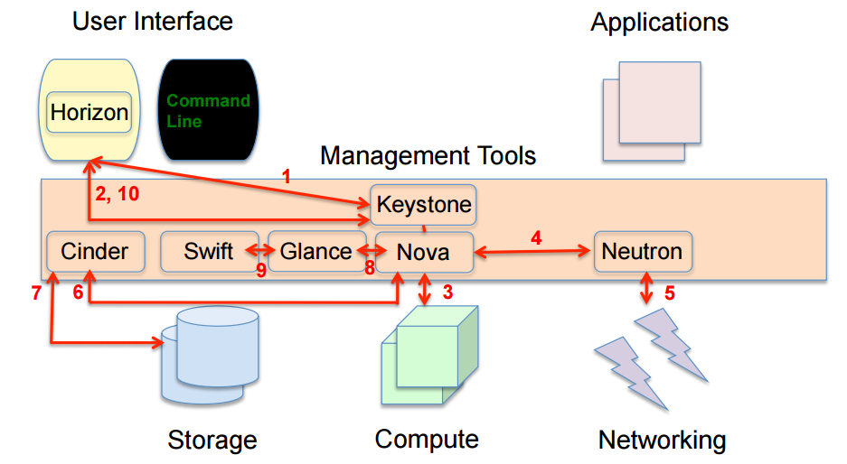

  Adam Jollans - IBM - SCALE 13x

References
----------

* `KVM, OpenStack, and the Open Cloud -- Adam Jollans`__

.. __: http://www.socallinuxexpo.org/scale/13x/presentations/kvm-openstack-and-open-cloud
